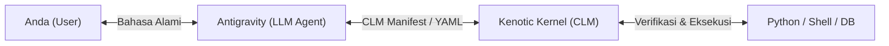
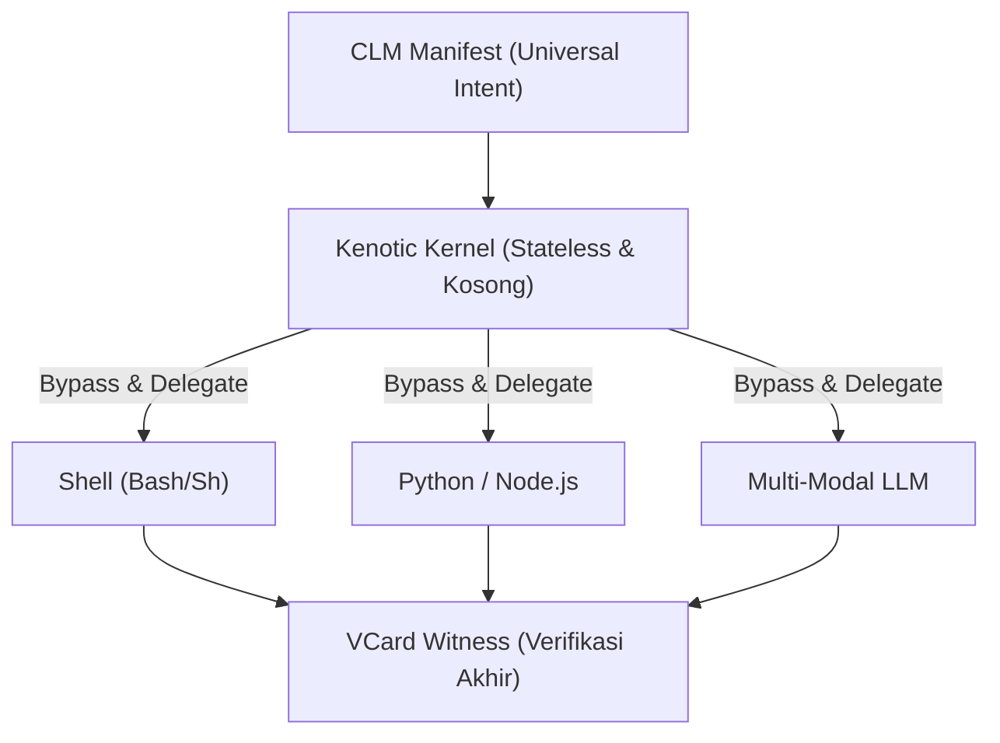

# 💬 AI Conversation: saya sedang dienviron CLM, apa itu CLM dan apa gunanya, baga...

> [!INFO] Metadata Session
> - **Date & Time**: 2026-08-04 05.53
> - **AI Tool**: Antigravity (Gemini AI Agent)
> - **Session ID**: `cc20df57-bba2-4d59-8078-e3185f0f5462`
> - **Tools Used**: `grep_search`, `list_dir`, `run_command`, `view_file`
> - **Total Requests**: 6

## 📌 Topik & Request Utama
- saya sedang dienviron CLM, apa itu CLM dan apa gunanya, bagaimana cara kerjanya?
- Apa bedanya yang kamu (Antigravity) punya dengan CLM, dua-duanya juga bisa pakai conversational programming?
- apa itu post hog apakah ada manfaatnya untuk CLM?
- berarti posthog juga bermanfaat untuk project SO?
- apa polyglot harness?
- apa itu kenotic kernel?

## 📜 Transkrip Percakapan

### 👤 User

saya sedang dienviron CLM, apa itu CLM dan apa gunanya, bagaimana cara kerjanya?

---

### 🤖 AI Agent (Antigravity)

**CLM (Cubical Logic Model)** adalah bahasa formal untuk ***Conversational Programming*** (Pemrograman Berbasis Percakapan)—sebuah tata bahasa (*meta-grammar*) yang mengaitkan setiap interaksi (perintah terminal, instruksi teks chat, diagram visual, atau perintah suara) sebagai komputasi yang terverifikasi dan berbasis alamat konten (*content-addressed computation*).

Berikut adalah penjelasan lengkap mengenai **apa itu CLM, apa gunanya, dan bagaimana cara kerjanya**:

---

### 1. Apa itu CLM?

CLM adalah **meta-language universal (Polyglot Harness)** yang dirancang dari dasar untuk mendukung paradigma *Conversational Programming*. 

Di dalam CLM, membuat kode/program tidak berbeda dengan melakukan percakapan yang terstruktur. Daripada menulis sintaks kaku untuk runtime tertentu, CLM menyediakan bahasa tata bahasa universal yang dapat dipahami oleh manusia, LLM (Large Language Models), maupun runtime pemrograman tradisional (Python, Bash, Node.js, dll.).

---

### 2. Apa Gunanya CLM?

* **Conversational Programming**: Mengubah setiap *turn* percakapan (baik dari manusia atau LLM) menjadi langkah komputasi yang menyatakan maksud (*intent*), mengeksekusi tindakan, dan memverifikasi hasil secara otomatis.
* **Integrasi Lintas Bahasa & Modul (Universal Polyglot)**: Memungkinkan Anda menggabungkan skrip Shell, kode Python, kueri database, hingga inferensi Multi-Modal LLM dalam satu alur kerja (*pipeline*) tanpa harus menulis *glue code* yang rumit.
* **Verifikasi & Validasi Lintas Bahasa (Cross-Language VCard Sandwich)**: Memastikan setiap eksekusi terlindungi oleh pengujian prekondisi dan poskondisi. Misalnya, keluaran dari skrip Python dapat langsung divalidasi oleh utilitas Bash atau LLM secara formal.
* **Sistem Bebas Skala (Scale-Free Architecture)**: Tata bahasa CLM bersifat uniform dari level fungsi kecil, skrip otomasi, mikroservis, hingga orchestrasi antar-organisasi.
* **Antarmuka Agnostik (Interface-Agnostic)**: Kode CLM yang sama dapat dijalankan via **CLI**, **Text Chat Interface** (WebSocket/IPC), hing
<truncated 653 bytes>

CLM mengelompokkan semua objek dan logika komputasi ke dalam 3 jenis kartu (berdasarkan *Cubical Type Theory*):
1. **MCard (Memory Card / $\Sigma$-type)**: Menyimpan data/keadaan (*state*) statis yang dialamati dengan hash (*content-addressed*). Ini mewakili prekondisi ($A$ - Abstract).
2. **PCard (Process Card / $\Pi$-type)**: Menyimpan logika proses/transisi executable yang mengodekan fungsi transformasi ($C$ - Concrete).
3. **VCard (Verification Card / Identity Type)**: Menyimpan bukti verifikasi (*witness proof*) bahwa eksekusi dari prekondisi ke poskondisi berjalan sah dan tidak merusak sistem ($B$ - Balanced).

#### B. Kenotic Kernel (Kernel Tanpa State / Stateless Core)
Kernel CLM bersifat *stateless* dan *language-agnostic*. Daripada memproses/mengompilasi kode secara langsung, Kenotic Kernel bertindak sebagai delegator (*bypass & delegate*) yang mengirimkan instruksi ke runtime sesuai kebutuhan (seperti memanggil interpreter Python, eksekutor Bash, atau API LLM).

#### C. Siklus Verifikasi REPL & Petri Nets
Setiap alur di CLM dimodelkan sebagai **Bipartite Petri Net**:
$$\text{Precondition } (V_{\text{pre}}) \xrightarrow{\text{Execute } (P)} \text{Postcondition } (V_{\text{post}})$$
Sistem secara otomatis menguji prekondisi sebelum mengeksekusi tindakan, lalu memeriksa poskondisi untuk memastikan tidak ada kebocoran *state* (*state leakage*) atau pergeseran nilai (*state drift*).

#### D. Prinsip Empty Schema
Di tingkat basis data (`db/execution_log.db`), data dan fungsi diperlakukan sama (*Function-Number Duality*). Semua entitas disimpan dalam 3 tabel dasar sederhana:
* **Handle**: Identitas / nama konsep.
* **Card**: Definisi isi berbasis SHA-256 hash.
* **Version**: Riwayat perubahan/kausalitas (Merkle Link).

---

### Ringkasan

Dengan berada di environment **CLM**, Anda sedang mengerjakan sebuah framework / OS agen cerdas (*Agentic OS*) yang memungkinkan AI dan manusia memprogram sistem kompleks melalui percakapan, di mana setiap langkahnya dijamin aman, matematis, dan terverifikasi secara formal.

---

### 👤 User

Apa bedanya yang kamu (Antigravity) punya dengan CLM, dua-duanya juga bisa pakai conversational programming?

---

### 🤖 AI Agent (Antigravity)

Meskipun keduanya menggunakan istilah **"conversational programming"** (pemrograman berbasis percakapan), terdapat perbedaan mendasar antara **Antigravity (Saya/AI Agent)** dan **CLM (Cubical Logic Model)**. 

Singkatnya: **Saya adalah "Otak/Agen AI" (Brain/Agent), sedangkan CLM adalah "Fondasi Bahasa Formal & Runtime-nya" (Protocol/Grammar/OS Kernel).**

---

### Perbandingan Utama

| Dimensi | **Antigravity (AI Agent / Saya)** | **CLM (Cubical Logic Model)** |
| :--- | :--- | :--- |
| **Bentuk Entitas** | **AI Pair Programmer / Agentic Assistant** berbasis Large Language Model (LLM). | **Spesifikasi Formal, Meta-Grammar, & Kernel Execution** (Sistem/Framework). |
| **Arti *Conversational*** | Berinteraksi dalam **bahasa alami** (teks bahasa Indonesia/Inggris) melalui prompt, konteks chat, dan pemanggilan tool (`view_file`, `run_command`, dll.). | Setiap giliran percakapan (*turn*) diubah menjadi **struktur data matematis ($A \times C \times B$)** yang di-hash (SHA-256) dan terikat pada *Petri Net*. |
| **Sifat Penalaran** | **Probabilistik & Kontekstual**: Memahami maksud pengguna, bernalar tentang arsitektur, dan menuliskan kode secara fleksibel. | **Deterministik & Verifiabel**: Memastikan eksekusi aman, prekondisi terpenuhi, dan poskondisi terverifikasi secara sistematis. |
| **Keadaan State/Memori** | *Context window*, transkrip percakapan, serta file fisik di workspace. | *Content-Addressed Merkle DAG* (**MCards**) yang tersimpan imutabel di database (`execution_log.db`). |
| **Verifikasi** | Menguji kode melalui eksekusi terminal/unit test yang diamati oleh LLM. | Menggunakan **VCard (Verification Witness)** berbasis *Cubical Type Theory* dan hukum konservasi Petri Net ($x^\top D = 0$). |

---

### Bagaimana Keduanya Bekerja Bersama?

CLM merancang arsitektur di mana **Antigravity (LLM)** dan **CLM Kernel** saling melengkapi:

1. **Antigravity sebagai Adapter**: Di dalam arsitektur CLM, agen AI seperti Antigravity bertindak sebagai adapter **Multi-Modal LLM (`MM_LLM`)**. Antigravity membantu menerjemahkan intent atau percakapan manusia menjadi logika, skrip, atau dokumen design.
2. **CLM sebagai Pembungkus Verifikasi (*VCard Sandwich*)**: Apabila Antigravity atau skrip otomatis membuat perubahan atau mengeksekusi perintah, CLM "membungkus" eksekusi tersebut dalam triadic card:
   * **$A$ (Precondition / MCard)**: Meninjau kondisi sebelum dieksekusi.
   * **$C$ (Execution / PCard)**: Menjalankan perintah (misal skrip Python atau rekomendasi dari Antigravity).
   * **$B$ (Verification / VCard)**: Memverifikasi secara matematis bahwa hasilnya valid dan tidak merusak sistem.

---

### Kesimpulan

* **Antigravity** = Rekan berdiskusi dan agen pengeksekusi cerdas yang Anda ajak bicara saat ini.
* **CLM** = Aturan tata bahasa formal, sistem verifikasi, dan kernel infrastruktur tempat agen-agen AI dan kode-kode tersebut berjalan agar terstruktur, terarah, dan dapat diaudit secara matematis.

---

### 👤 User

apa itu post hog apakah ada manfaatnya untuk CLM?

---

### 🤖 AI Agent (Antigravity)

### 1. Apa itu PostHog?

**PostHog** adalah platform **Product Analytics & Observability** tingkat lanjut yang bersifat *open-source*. Berbeda dengan Google Analytics biasa yang hanya melacak kunjungan web dasar, PostHog adalah platform serba ada (*all-in-one suite*) yang menyediakan:

* **Product Analytics**: Melacak *events*, alur pengguna (*funnel*), retensi, dan performa fitur.
* **Session Replay**: Merekam dan memutar ulang sesi interaksi pengguna secara visual (misalnya gerakan kursor, ketikan di antarmuka chat).
* **Feature Flags & A/B Testing**: Membuka atau menutup fitur baru untuk pengguna tertentu secara bertahap tanpa perlu *re-deploy* aplikasi.
* **Error Tracking & Exception Monitoring**: Memantau *crash*, kebocoran *error*, dan masalah performa di sisi klien maupun server.
* **Surveys & Feedback**: Mengumpulkan umpan balik pengguna langsung dari dalam aplikasi.
* **Self-Hostable**: Dapat dijalankan di server sendiri (lokal/on-premise) atau menggunakan versi Cloud.

---

### 2. Apakah Ada Manfaatnya untuk CLM (Cubical Logic Model)?

**Ya, sangat bermanfaat**, terutama untuk **Observabilitas Runtime, Telemetri Governance, dan Analisis Interaksi Antarmuka Chat/Multi-Modal di CLM.**

Berikut adalah analisis manfaat spesifik PostHog dalam arsitektur CLM:

#### A. Telemetri di Level 3 (Governance Layer)
Dalam *4-Tier Type Lattice* CLM, Level 3 adalah **Governance** (Otorisasi, Batasan Integritas, dan **Telemetri**):
* **Manfaat**: PostHog dapat berfungsi sebagai *telemetry sink* (penampung data telemetri). Setiap kali skrip/playbook CLM dijalankan, event dapat dikirim ke PostHog untuk memantau metrik kesehatan sistem secara terpusat.

#### B. Tracing & Analisis Keberhasilan Triad $A \times C \times B$
Di CLM, eksekusi dilakukan via siklus prekondisi $\to$ eksekusi $\to$ poskondisi ($V_{\text{pre}} \to P \to V_{\text{post}}$):
* **Tracking Kegagalan VCard (Witness Failures)**: Anda bisa mengirimkan event ke PostHog setiap kali verifikasi VCard gagal. Ini memudahkan untuk melihat fitur atau skrip mana yang 
<truncated 292 bytes>
untuk Chat Interface (Phase 2 & 3 Roadmap)
CLM memiliki WebSocket Chat Gateway (Phase 2) dan antarmuka Multi-Modal (Phase 3):
* **Session Replay di Chat UI**: Mengamati bagaimana pengguna berinteraksi dengan antarmuka chat CLM, seperti mana tombol/komando yang membingungkan atau di mana terjadi kendala UX saat pengguna mengirimkan instruksi conversational programming.
* **Tracking Latensi Executing/LLM**: Mengukur berapa lama waktu yang dibutuhkan dari giliran percakapan (*conversational turn*) hingga Kenotic Kernel selesai mendelegasikan eksekusi dan mengembalikan VCard.

#### D. Feature Flags untuk Peluncuran Playbook/Eksperimen
* Anda dapat menggunakan fitur **Feature Flags** milik PostHog untuk menguji coba jenis `PCard` baru, algoritma *Petri Net*, atau prompt LLM baru hanya kepada sebagian agen/pengguna sebelum dirilis secara universal.

#### E. Keselarasan Filosofi Self-Hosted & Privasi
Karena CLM mengusung privasi, independensi, dan *content-addressing*, PostHog yang bersifat *open-source* dan bisa di-*self-host* secara lokal/private cloud sangat cocok dengan filosofi arsitektur CLM tanpa harus mengirim data sensitif ke pihak ketiga.

---

### Ringkasan

| Fitur PostHog | Manfaat untuk CLM |
| :--- | :--- |
| **Event Tracking** | Mengukur metrik eksekusi `MCard`/`PCard`/`VCard` dan latensi *Kenotic Kernel*. |
| **Error & Exception Tracking** | Memantau kegagalan verifikasi poskondisi (*VCard failures*) atau *runtime crash*. |
| **Session Replay** | Merekam interaksi pengguna di antarmuka *Text/Multi-Modal Chat Gateway*. |
| **Feature Flags** | Menguji coba *playbook*, *type lattice*, atau adapter LLM baru secara aman. |
| **Self-Hosted** | Menjaga agar telemetry & log eksekusi CLM tetap berada di infrastruktur sendiri. |

**Kesimpulan:** PostHog sangat berguna jika CLM mulai dihubungkan dengan antarmuka pengguna (seperti Chat Gateway/Dashboard) atau ketika Anda membutuhkan sistem **telemetri & observabilitas** yang andal untuk memantau performa dan kegagalan eksekusi skrip/playbook CLM secara *real-time*.

---

### 👤 User

berarti posthog juga bermanfaat untuk project SO?

---

### 🤖 AI Agent (Antigravity)

**Ya, SANGAT BERMANFAAT!** Bahkan untuk **Project SO (Sacred Octagon — GASING Educational Game Platform)**, manfaat PostHog bisa dibilang **jauh lebih terasa dan berdampak langsung** secara operasional dibandingkan dengan CLM backend murni.

Karena Project **SO** adalah platform gim edukasi berbasis web/PWA (*user-facing application*) yang diakses langsung oleh siswa, guru, dan admin sekolah, PostHog menjadi alat yang sangat ampuh untuk mengukur efektivitas pembelajaran dan pengalaman pengguna (*UX*).

Berikut adalah manfaat konkret PostHog untuk **Project SO**:

---

### 1. Analitik Pembelajaran & Kemajuan Game (*Game & Funnel Analytics*)
* **Pelacakan Alur Siswa (*Level Drop-off*)**: Anda dapat membuat *funnel analysis* dari Zona 1 hingga Zona 5 (Penjumlahan, Pengurangan, Perkalian, Pembagian, dll.).
  * *Contoh*: Anda bisa melihat persentase siswa yang gagal/menyerah di level tertentu (misalnya Zona 3 Level 4 - Perkalian) dan menyesuaikan tingkat kesulitannya.
* **Popularitas Mode Game**: Mengukur mesin gim mana yang paling banyak dimainkan atau paling efektif disukai siswa (`BermainEngine`, `BertualangEngine`, `Luxor`, `Tetris`, dll.).
* **Retensi Belajar**: Mengukur seberapa sering siswa kembali bermain/belajar dalam seminggu (*Daily Active Users / Retention Rate*).

---

### 2. Session Replay (Melihat Cara Siswa Bermain & Menggunakan UI)
* **Debugging UX Game di Perangkat Sekolah**: PostHog Session Replay memungkinkan Anda "memutar ulang" rekaman layar siswa saat bermain PWA di tablet atau HP.
* **Deteksi Kendala Interaksi**: Anda bisa melihat apakah siswa kebingungan dengan *HUD Bar*, kontrol suara (`VolumeControls`), *Glassmorphic Victory Modal*, atau tombol navigasi saat bermain.

---

### 3. Evaluasi AI Tutor (`gasing-tutor` / WebLLM)
Project SO memiliki integrasi **AI Tutor** (Ollama + `@mlc-ai/web-llm` / *Hybrid Facade Router*):
* **Lacak Penggunaan Hint**: Berapa kali siswa meminta bantuan *4-tier scaffolding hints* dari AI Tutor di setiap level.
* **Deteksi Topik Matematika yang Sulit**: Event Pos
<truncated 40 bytes>
ematika apa yang paling sering memicu permintaan petunjuk AI.
* **Performa Hybrid Router**: Melacak berapa persen interaksi yang berhasil diproses secara lokal di browser via WebGPU/WebLLM dibanding yang *fallback* ke server Ollama.

---

### 4. Feature Flags untuk Peluncuran Fitur & Level Baru
* **Uji Coba Level/Mesin Game Baru**: Sebelum merilis Zona atau Mini-Game baru ke 524k+ sekolah, Anda dapat mengaktifkannya via PostHog *Feature Flag* hanya untuk sekolah atau grup penguji (*cohort*) tertentu.
* **Manajemen Lisensi B2B**: Membuka/menutup fitur *Premium Overlay* atau modul pelatihan sesuai status lisensi (Zitadel OIDC / Xendit checkout).

---

### 5. Error Tracking & Monitoring Performa PWA (Offline/Online)
* **Deteksi Game Crash**: Menangkap *runtime error* di mesin gim berbasis Astro/Three.js/Anime.js pada berbagai perangkat browser (Chromium, Firefox, Safari iPad).
* **Performa Service Worker & Assets Loading**: Mengukur waktu *load asset* (seperti 3.4GB media dari MinIO/nginx) dan memantau sesi saat PWA dimainkan secara *offline*.

---

### Ringkasan Manfaat PostHog di Project SO vs CLM

| Area | Manfaat di CLM (Backend/OS) | Manfaat di Project SO (Game Platform) |
| :--- | :--- | :--- |
| **Fokus Utama** | Observabilitas skrip, log eksekusi, & *VCard verification*. | **Pengalaman belajar siswa, retensi, & performa game UI.** |
| **Session Replay** | Rekaman interaksi pada antarmuka chat/CLI. | **Melihat cara siswa bermain game & berinteraksi dengan AI Tutor.** |
| **Funnel Analysis** | Alur eksekusi *Playbook* & *Petri Net*. | **Progres belajar dari Zona 1 ke Zona 5 (30 level).** |
| **Feature Flags** | Merilis skrip/adapter LLM baru secara bertahap. | **Merilis zona game baru, fitur lisensi B2B, atau modul sekolah.** |

**Kesimpulan:** Mengintegrasikan SDK PostHog (misalnya `@posthog/js` atau via Web Component Astro) ke dalam Project SO akan memberikan wawasan mendalam (*actionable insights*) tentang bagaimana gim matematika GASING dimainkan dan sejauh mana efektivitas AI Tutor membantu siswa belajar.

---

### 👤 User

apa polyglot harness?

---

### 🤖 AI Agent (Antigravity)

Secaraterjemahan harfiah dan konsep dasar:

* **Polyglot** = Menguasai / mendukung **banyak bahasa** (bisa berupa bahasa pemrograman seperti Python, Bash, JavaScript, maupun bahasa alami/prompt AI dan diagram visual).
* **Harness** = Kerangka pengikat, wadah penopang, atau "tali kekang" (*wrapper/framework*) tempat berbagai komponen dipasang dan dikendalikan secara seragam.

Secara keseluruhan, **Polyglot Harness** adalah **kerangka kerja penghubung universal yang memungkinkan berbagai bahasa pemrograman dan format instruksi yang berbeda-beda untuk berjalan, berkomunikasi, dan diverifikasi di dalam satu wadah/sistem yang sama tanpa perlu menulis *glue code* (kode penyambung) secara manual.**

---

### Mengapa CLM Disebut *"Universal Polyglot Harness"*?

Dalam proyek **CLM (Cubical Logic Model)**, fitur ini dijelaskan sebagai salah satu pilar utamanya. Berikut adalah alasannya:

#### 1. Menghubungkan Berbagai Bahasa Komputasi
Di dalam CLM, Anda bisa menggabungkan berbagai bahasa dalam satu alur kerja (*pipeline*):
* **Bahasa Skrip/Sistem**: Bash, Shell.
* **Bahasa Pemrograman**: Python, Node.js, Rust, Go.
* **Bahasa Alami (Natural Language)**: Instruksi manusia atau prompt untuk LLM (Large Language Model).
* **Bahasa Visual/Diagram**: Diagram Mermaid, skema arsitektur, atau mockup.

#### 2. Tanpa *Glue Code* (Kode Penyambung) yang Rumit
Biasanya, jika Anda ingin program Python memanggil skrip Bash, lalu mengirim hasilnya ke LLM dan menyimpannya di basis data, Anda harus menulis banyak kode khusus (*boilerplate/glue code*) untuk memformat data di setiap perbatasan.

Dengan **CLM sebagai Polyglot Harness**:
Semua komponen tersebut dibungkus (*harnessed*) ke dalam format manifes universal yang sama ($A \times C \times B$ / `MCard`, `PCard`, `VCard`). CLM menyediakan antarmuka tunggal yang dipahami oleh semua komponen tersebut.

#### 3. Verifikasi Lintas Bahasa (*Cross-Language Validation*)
Karena semua bahasa diikat di dalam *harness* yang sama oleh **Kenotic Kernel** CLM:
* Hasil kalkulasi dari skrip **Python** dapat langsung divalidasi oleh skrip **Bash**.
* Gambar/diagram yang dianalisis oleh **Multi-Modal LLM** dapat divalidasi kebenaran strukturnya terhadap aturan **Database**, semuanya disegel dalam satu bukti verifikasi (*VCard postcondition*).

---

### Analogi Sederhana

1. **Adapter Stopkontak Internasional Universal**:
   Bayangkan Anda memiliki peralatan elektronik dari berbagai negara dengan colokan yang berbeda (ada colokan tipe Inggris, Amerika, Eropa, Jepang). **Polyglot Harness** adalah stopkontak universal super canggih tempat colokan dari negara mana pun (Python, Bash, LLM, JS) bisa langsung dicolokkan dan bekerja dengan aman.

2. **Protokol Sidang PBB**:
   Di sidang PBB, para delegasi berbicara dalam bahasa yang berbeda-beda (Prancis, Arab, Mandarin, Inggris). **Polyglot Harness** adalah sistem protokol dan penerjemah PBB yang memastikan setiap ucapan dari bahasa apa pun dipahami, dicatat, dan diverifikasi dengan aturan sidang yang seragam.

---

### 👤 User

apa itu kenotic kernel?

---

### 🤖 AI Agent (Antigravity)

Secara etimologi dan filosofi, kata **Kenotic** berasal dari konsep *Kenosis* (Yunani: *kénōsis*) yang berarti **"pengosongan diri"** (*self-emptying*).

Di dalam proyek **CLM (Cubical Logic Model)**, **Kenotic Kernel** adalah **inti runtime eksekusi yang bersifat seratus persen stateless (tanpa memori/state internal kaku) dan agnostik terhadap bahasa pemrograman (language-agnostic).**

---

### Ciri Utama Kenotic Kernel

#### 1. Tidak Melakukan Kompilasi Langsung (*Bypass & Delegate*)
Kernel tradisional (seperti Kernel Linux atau JVM) mengompilasi kode ke instruksi mesin kaku dan mengelola memori secara langsung. 

Sebaliknya, **Kenotic Kernel tidak mengompilasi kode**. Kernel ini bertindak sebagai perantara murni yang **mendelegasikan eksekusi** langsung ke adapter atau runtime yang paling sesuai (seperti interpreter Python, skrip Bash, Node.js, atau mesin inferensi Multi-Modal LLM).

#### 2. Prinsip Skema Kosong (*Empty Schema Principle*)
Mengapa dinamai *"Kenotic"* (Pengosongan)?
Sistem ini memegang prinsip filosofis dan matematis: **"Sistem harus dimulai dari kekosongan mutlak (Zero Structural Ego) agar memiliki kapasitas adaptasi maksimal."**

Dalam CLM, hal ini dirumuskan dalam persamaan *Rank-Nullity Design*:
$$\text{rank}(\text{Asumsi}) + \text{nullity}(\text{Kapasitas Adaptif}) = n$$

Jika asumsi kaku kernel ditekan hingga nol ($\text{rank} = 0$), maka kapasitas adaptif sistem untuk memproses berbagai jenis data/logika menjadi maksimal ($\text{nullity} = n$). Hal ini memungkinkan LLM atau agen AI membentuk logika secara dinamis tanpa perlu migrasi database yang rumit.

#### 3. Penjaga Verifikasi Triad ($A \times C \times B$)
Meskipun Kenotic Kernel tidak mengeksekusi logika internal secara langsung, kernel ini bertugas **memastikan hukum verifikasi**:
1. Mengecek **Prekondisi ($A$ / MCard)** sebelum mendistribusikan tugas.
2. Mendelegasikan **Eksekusi ($C$ / PCard)** ke runtime target.
3. Memastikan bukti hasil eksekusi مختوم dalam **Poskondisi ($B$ / VCard)**.

---

### Analogi Sederhana

* **Analogi Operator Sentral Telepon yang Netral**:
  Bayangkan seorang operator telepon yang tidak ikut campur dalam isi pembicaraan dan tidak memihak pada bahasa mana pun yang digunakan penelpon. Operator tersebut "kosong dari asumsi" (*kenotic*); tugasnya hanya menerima sambungan, mengarahkannya ke nomor/runtime tujuan yang tepat (Python, Bash, LLM), dan memastikan bahwa panggilan telah tersambung dan selesai dengan aman.

---

### Ringkasan

**Kenotic Kernel** adalah "jantung" CLM yang netral, kosong dari asumsi kaku, dan bebas state, yang bertugas membagikan instruksi ke berbagai bahasa/runtime serta menjamin bahwa hasilnya selalu terverifikasi secara formal.

---

## 🔗 References & Links
- **Daily Note**: [[Note Harian - 2026-08-04]]
- **Index**: [[01 - Notes/AI Conversations/Index|Index AI Conversations]]
