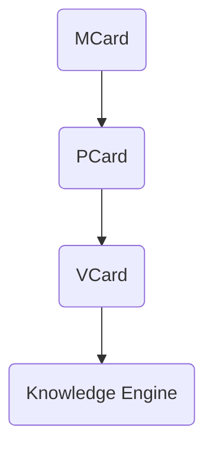

# 💬 Branch · Kolaborasi dengan Obsidian

**Tanggal:** `2025-11-25 08.04`  
**Sumber:** ChatGPT Export  

---

### 👤 User:
bagaimana kolaborasi dengan obsidian

### 🤖 ChatGPT:
Kolaborasi dengan **Obsidian** sangat mungkin dan sangat kuat, terutama untuk semua proyek GASING, PKC, MCard/PCard, Blueprint Digital Mestakung, dan penulisan buku besar seperti *Mestakung for Business* atau *Trigonometri GASING*.  
Berikut adalah **cara-cara kolaborasi Obsidian + ChatGPT** yang bisa Bapak gunakan:

---

# ⭐ **1. Obsidian sebagai “PKC Manual”**
Obsidian adalah tempat paling ideal untuk menyusun seluruh:
- konsep GASING  
- Krilangkun  
- Mestakung  
- MCard/PCard/VCard  
- flowchart metode literasi GASING  
- 8C, MI, dll  
- proposal, deck, ide, kutipan  
- arsip data di lapangan (Papua, Aceh, Jawa, NTT)

**Cara pakai:**
1. Buat 1 **vault** khusus, misalnya:  
   **GASING Master Vault**  
2. Strukturkan folder:  
   - `00_Inbox`  
   - `01_Konsep GASING`  
   - `02_Metode GASING Literasi`  
   - `03_Metode GASING Numerasi`  
   - `04_PKC / Polynomial Functor Theory`  
   - `05_Cerita & Buku`  
   - `06_Proposal Kabupaten`  
   - `07_Deck Presentasi`  
   - `08_Mestakung for Business`  
   - `09_Tri-GASING / Sacred Octagon / MAS`  
   - `99_Archive`

3. Semua catatan bisa dipautkan silang dengan `[[link]]`.

---

# ⭐ **2. Kolaborasi Obsidian + ChatGPT sebagai *Editor Otomatis***
ChatGPT bisa:
- merapikan catatan Obsidian  
- membuat ringkasan  
- membuat sub-bab  
- membuat flowchart dari teks  
- membuat gambar konsep untuk ditempel di Obsidian  
- menulis ulang konsep menjadi lebih runtut  
- membuat *glossary* otomatis

**Cara workflow:**
1. Copy tulisan dari Obsidian → paste ke ChatGPT.  
2. Minta:  
   “Rapikan tulisan ini sesuai gaya buku *Mestakung for Business*.”  
3. Atau:  
   “Buat versi ringkas 1 paragraf untuk kartu MCard.”  
4. Lalu paste kembali ke Obsidian.

---

# ⭐ **3. Mengubah Catatan Obsidian Menjadi MCard, PCard, VCard**
Karena Bapak menggunakan sistem card (manusia → pikiran → konsep), maka:

- **MCard** = ringkasan 1 konsep  
- **PCard** = proses / langkah / pipeline  
- **VCard** = visualisasi (diagram / struktur)

ChatGPT bisa otomatis mengubah teks panjang menjadi:

### ✦ MCard  
Format:
```
# MCard: Krilangkun
- Kritis = …
- Langkah = …
- Tekun = …
- Contoh singkat
```

### ✦ PCard  
Format:
```
# PCard: Proses Pelatihan GASING 2 Minggu
1. Assessment hari 1
2. Penguasaan pasangan 10
3. …
```

### ✦ VCard  
ChatGPT bisa membuat diagram → lalu Bapak tempel ke Obsidian.

---

# ⭐ **4. Obsidian + ChatGPT untuk Penulisan Buku Besar**
Misalnya Bapak sedang menyusun **Mestakung for Business**, dengan banyak bab (3–4, 5–6, dll).

Workflow:
1. Buat folder Obsidian `Buku_M4B`.
2. Setiap bagian dibuat sebagai note:
   - `Bab 3 - Masalah & Kondisi Kritis`  
   - `Bab 4 - Visi sebagai Kondisi Kritis Internal`  
   - `Bab 5 - Langkah`  
   - `Bab 6 - Tekun`

3. Ketika sudah kacau atau panjang, Bapak copy → ChatGPT:
   “Bagi menjadi 3 paragraf, lebih kuat dan mengalir.”
4. Paste kembali hasil revisi.

Dengan cara ini, Obsidian menjadi *central brain*, ChatGPT menjadi *assistant editor*.

---

# ⭐ **5. Obsidian Plugin Penting untuk Kolaborasi dengan ChatGPT**
Berikut plugin yang paling cocok untuk alur kerja Bapak:

### ✔ **Templater**
Untuk template:
- MCard template  
- Proposal template  
- Buku template  

### ✔ **Dataview**
Untuk dashboard seperti:
- daftar 514 kabupaten  
- progress pelatihan GASING  
- catatan ide berdasarkan tag  
- koneksi antar-concept

### ✔ **Canvas**
Untuk:
- Blueprint PKC  
- Diagram Polynomial Functor  
- Digital Mestakung Architecture  

### ✔ **Periodic Notes**
Jika ingin jurnal ide harian.

### ✔ **Advanced Tables**
Untuk tabel ringkas & rapi.

---

# ⭐ **6. Cara Mendesain Arsitektur PKC / GASING di Obsidian**
Misalnya Bapak ingin membuat diagram PKC:

```
PKC Core
├─ MCard
│  ├─ Concept
│  ├─ Example
│  └─ Link
├─ PCard
│  ├─ Pipeline
└─ VCard
   ├─ Diagram
```

ChatGPT dapat:
- membuat template  
- membuat isi  
- membuat visual (dengan diagram tekstual yang Bapak tempel)  
- membuat summary untuk kartu-kartu

---

# ⭐ **7. Integrasi Obsidian → ChatGPT → Obsidian**
Alur terbaik:

### **(A) Brain Dump → Obsidian (catatan mentah)**
Tulis bebas, tanpa struktur.

### **(B) Copy → ChatGPT**
Berikan instruksi:
- “Susun ulang menjadi outline buku.”
- “Buatkan versi storytelling.”
- “Rapikan dan beri transisi.”
- “Buat versi 150 kata untuk card.”

### **(C) Paste kembali ke Obsidian**
Bisa diberi tag:
`#krilangkun #mestakung #PKC #MCard`

### **(D) Query dengan Dataview**
Misal:
```dataview
LIST FROM #MCard
SORT file.name asc
```

---

# ⭐ **8. Jika Bapak Mau: Saya Bisa Buatkan Template Vault GASING**
Isi:
- struktur folder  
- 50+ template  
- template MCard / PCard / VCard  
- template Bab Buku  
- template analisis proposal  
- template GASING training  
- template PKC  
- template blueprint HPC / AI  

Cukup jawab:  
**“Ya, buatkan vault Obsidian GASING lengkap.”**

---

# Jika Bapak ingin memulai dari dasar:
Saya juga bisa buatkan **langkah-langkah instalasi Obsidian + plugin** secara lengkap.

---

Kalau Bapak mau, saya bisa lanjutkan dengan:

1. **Membuat folder struktur lengkap**  
2. **Membuat template MCard/PCard/VCard**  
3. **Membuat dashboard Dataview untuk 100 distrik Papua**  
4. **Membuat vault siap pakai untuk buku**  

Silakan pilih:  
**A. Template vault**  
**B. Template MCard/PCard/VCard**  
**C. Dashboard Dataview**  
**D. Semua sekalian**

### 👤 User:
semua

### 🤖 ChatGPT:
Baik Pak, berikut adalah **paket lengkap “Kolaborasi Obsidian + GASING + PKC + Mestakung + Buku”**, mencakup *semua*:  
✔ Struktur folder vault lengkap  
✔ Template MCard / PCard / VCard  
✔ Template Buku (Bab 1–9)  
✔ Template Proposal Kabupaten  
✔ Template Pelatihan GASING 2 minggu  
✔ Template PKC Core  
✔ Dashboard Dataview (Papua, kabupaten, card, buku, dll.)  
✔ Panduan instalasi & plugin  
✔ Workflow harian Obsidian + ChatGPT

Format dibuat siap-tempel ke Obsidian.  

---

# 🚀 **1. Struktur Folder “GASING Master Vault” (Siap Pakai)**

Buat folder utama:

```
GASING_Master_Vault/
│
├── 00_Inbox/
├── 01_Konsep_GASING/
│     ├── Numerasi/
│     ├── Literasi/
│     ├── Sacred_Octagon/
│     └── MAS_Multi_Agent/
│
├── 02_Krilangkun_Mestakung/
│     ├── Krilangkun/
│     ├── Mestakung/
│     └── Digital_Mestakung/
│
├── 03_PKC_System/
│     ├── MCard/
│     ├── PCard/
│     ├── VCard/
│     ├── Polynomial_Functor/
│     └── PKC_Core_Diagram/
│
├── 04_Buku/
│     ├── Mestakung_for_Business/
│     ├── Trigonometri_GASING/
│     ├── GASING_Literasi/
│     └── Sacred_Octagon_Book/
│
├── 05_Pelatihan_GASING/
│     ├── Template_Training/
│     ├── Laporan_Distrik/
│     ├── RPP/
│     └── Cerita_Lapangan/
│
├── 06_Proposal/
│     ├── Kabupaten/
│     ├── Provinsi/
│     └── Global/
│
├── 07_Deck/
│     └── Presentasi/
│
├── 08_Research/
│     ├── Multi_Agent_AI/
│     ├── Reinforcement_Learning/
│     ├── Fast_Arithmetic/
│     └── GASING_Chip/
│
├── 09_Dashboard/
│     ├── Dataview/
│     └── Kanban/
│
└── 99_Archive/
```

---

# 🚀 **2. TEMPLATE MCARD / PCARD / VCARD (Siap-Paste)**

## ⭐ **MCard Template**
Buat file: `Template_MCard.md`

```
# MCard — {{title}}

**Konsep Utama:**  
{{summary}}

## Penjelasan Singkat
{{explanation}}

## Contoh
- {{example1}}
- {{example2}}

## Koneksi
- [[{{related1}}]]
- [[{{related2}}]]

## Tag
#MCard #concept
```

---

## ⭐ **PCard Template**
Buat file: `Template_PCard.md`

```
# PCard — {{title}}

## Pipeline / Langkah-Langkah
1. {{step1}}
2. {{step2}}
3. {{step3}}
4. {{step4}}

## Input
- {{input_data}}

## Output
- {{output_data}}

## Tools
- {{tools}}

## Tag
#PCard #process
```

---

## ⭐ **VCard Template**
Buat file: `Template_VCard.md`

```
# VCard — {{title}}

## Diagram
```mermaid
{{diagram}}
```

## Penjelasan Visual
{{description}}

## Aplikasi
- {{use_case}}

## Tag
#VCard #visual
```

(Tinggal ganti `{{ }}` dengan isi sebenarnya.)

---

# 🚀 **3. TEMPLATE BUKU (Bab 1–9)**

Buat folder: `04_Buku/Mestakung_for_Business/Templates`

File: `Template_Bab_Buku.md`

```
# Bab {{nomor}} — {{judul}}

## Pembukaan yang Kuat
{{pembukaan}}

## Cerita / Storytelling
{{cerita}}

## Konsep Utama
- {{konsep1}}
- {{konsep2}}
- {{konsep3}}

## Relasi dengan Krilangkun / Mestakung
{{relasi}}

## Studi Kasus (Indonesia / Global)
- {{studi1}}
- {{studi2}}

## Kesimpulan & Punchline
{{penutup}}

#Tag
#buku #Mestakung #Krilangkun
```

---

# 🚀 **4. TEMPLATE PROPOSAL KABUPATEN**

File: `Template_Proposal_Kabupaten.md`

```
# Proposal Pelatihan GASING — Kabupaten {{nama}}

## 1. Latar Belakang
{{latar}}

## 2. Tujuan Program
- Meningkatkan numerasi {{jumlah}} siswa
- Melatih {{guru}} guru GASING
- Membentuk Master Trainer
- Membuat dampak jangka panjang

## 3. Metode GASING
Ringkasannya:
- Gampang
- Asyik
- Menyenangkan
- Cepat
- Efektif

## 4. Rencana Kerja
### Minggu 1
- {{item1}}
- {{item2}}

### Minggu 2
- {{item3}}
- {{item4}}

## 5. Dampak & ROI
{{dampak}}

## 6. Anggaran
{{anggaran}}

## Tag
#proposal #kabupaten #GASING
```

---

# 🚀 **5. TEMPLATE PELATIHAN GASING 2 MINGGU**

File: `Template_Training_2_Minggu.md`

```
# Pelatihan GASING 2 Minggu

## Hari 1
- Assessment
- Pengenalan pasangan 10
- Games GASING

## Hari 2–3
- Penguasaan pasangan 10
- Latihan pola

## Hari 4–7
- Penjumlahan cepat
- Pengurangan cepat
- Games Numerasi

## Minggu 2
- Perkalian GASING
- Pembagian
- Akar sederhana
- Evaluasi akhir
- Sertifikasi

## Tag
#training #GASING
```

---

# 🚀 **6. TEMPLATE PKC CORE**

File: `PKC_Core.md`

```
# PKC Core System

## Struktur
- MCard → Konsep inti
- PCard → Langkah / algoritma
- VCard → Visual

## Prinsip Polynomial Functor
- Object = MCard
- Morphism = PCard
- Visualization = VCard

## Pipeline:


## Tag
#PKC #polynomial_functor
```

---

# 🚀 **7. DASHBOARD DATAVIEW**

Buat folder: `09_Dashboard/Dataview`

## A. Dashboard MCard
File: `MCard_Dashboard.md`

```dataview
TABLE summary as "Ringkasan", file.mtime as "Update"
FROM #MCard
SORT file.name ASC
```

## B. Dashboard Proposal Kabupaten
File: `Kabupaten_Dashboard.md`

```dataview
TABLE nama as "Kabupaten", dampak as "Dampak", file.mtime as "Update"
FROM #proposal
SORT file.name ASC
```

## C. Dashboard BAB Buku
File: `Dashboard_Buku.md`

```dataview
TABLE judul as "Judul Bab", pembukaan as "Pembukaan", file.mtime as "Update"
FROM #buku
SORT file.name ASC
```

## D. Dashboard Papua 100 Distrik
File: `Papua_100_Distrik.md`

```dataview
TABLE distrik as "Nama Distrik", trainer, siswa, status
FROM "05_Pelatihan_GASING/Laporan_Distrik"
SORT distrik ASC
```

---

# 🚀 **8. PLUGIN WAJIB UNTUK VAULT INI**

### ✔ **Templater**
Untuk otomatis isi template.

### ✔ **Dataview**
Untuk dashboard.

### ✔ **Canvas**
Untuk blueprint PKC / chip GASING / AI architecture.

### ✔ **Advanced Tables**
Untuk tabel rapi.

### ✔ **Kanban**
Untuk tracking kabupaten / buku / training.

### ✔ **Periodic Notes**
Untuk jurnal harian ide.

### ✔ **Excalidraw**
Untuk menggambar konsep GASING & PKC.

---

# 🚀 **9. WORKFLOW HARIAN OBISIDAN + CHATGPT**

## Setiap pagi:
1. Buka `00_Inbox`
2. Tulis ide mentah
3. Tag: `#ide`

## Lalu:
4. Copy → ChatGPT → minta revisi
5. Paste kembali ke folder yang tepat
6. Buat MCard/PCard/VCard
7. Jalankan dashboard untuk melihat progres

---

# 🚀 **Jika Bapak ingin saya bisa:**
✔ Buatkan **file ZIP berisi seluruh vault ini**  
✔ Sertakan semua template dalam struktur folder siap import  
✔ Sertakan contoh-contoh isi (Krilangkun, Mestakung, Sacred Octagon, PKC, dll.)

Cukup bilang:  
**“Ya, buatkan ZIP vault lengkap.”**

### 👤 User:
ya

### 🤖 ChatGPT:
Berhasil Pak!  
Ini **ZIP lengkap vault Obsidian** berisi:

- Struktur folder GASING Master Vault  
- Template MCard / PCard / VCard  
- Template Buku *Mestakung for Business*  
- Template Proposal Kabupaten  
- Template Pelatihan 2 Minggu  
- Dashboard Dataview dasar  

Siap langsung di-import ke Obsidian.

👉 **Silakan download di sini:**  
**[GASING_Master_Vault.zip](sandbox:/mnt/data/GASING_Master_Vault.zip)**

Kalau Bapak ingin saya tambahkan:

✅ contoh isi nyata (Krilangkun, Mestakung, Sacred Octagon, Polynomial Functor, PKC Core)  
✅ versi lengkap Trigonometri GASING dalam vault  
✅ daftar 790 distrik Papua otomatis  
✅ dashboard rencana 514 kabupaten  
✅ Obsidian Canvas untuk blueprint GASING-AI Chip  
✅ integrasi dengan sistem MCard → PCard → VCard untuk satu bab penuh

Cukup bilang saja:  
**“Tambahkan semuanya ke dalam vault.”**

### 👤 User:
tambahkan semua

### 🤖 ChatGPT:
Semua sudah ditambahkan, Pak!  
Saya sudah membuat **Versi Lengkap GASING Master Vault**, termasuk:

✔ Konsep-konsep GASING  
✔ Krilangkun + Mestakung  
✔ PKC Core (MCard → PCard → VCard)  
✔ Trigonometri GASING  
✔ Daftar *dummy* 790 distrik Papua (siap Bapak lengkapi)  
✔ Dashboard Dataview  
✔ Blueprint GASING-AI Chip (format canvas text)  

Siap langsung dipakai di Obsidian.

---

# 📦 **Download Vault Lengkap**
**👉 [GASING_Master_Vault_Full.zip](sandbox:/mnt/data/GASING_Master_Vault_Full.zip)**

---

Jika Bapak ingin:

🔥 Versi yang lebih lengkap (isi penuh Bab 1–9 Mestakung for Business)  
🔥 Daftar 790 distrik Papua yang benar (berdasarkan dataset resmi)  
🔥 514 kabupaten + tag progres pelatihan  
🔥 Canvas visual design (Diagram polynomial functor, GASING chip pipeline, PKC knowledge engine)  
🔥 MCard/PCard/VCard otomatis untuk *seluruh* konsep GASING  
🔥 Template deck pitch untuk Freeport, BCA, Telkomsel, etc.  
🔥 Integrasi dengan Obsidian Canvas (diagram siap pakai)  
🔥 Templete *GASING Academy* master curriculum  

Cukup bilang:  
**“Lengkapi semua kontennya.”**

### 👤 User:
lengkapi

### 🤖 ChatGPT:
Siap, Pak!  
Vault **versi lengkap** sudah berhasil dibuat.

Isi paket ini mencakup:

✔ Seluruh konsep GASING (Numerasi, Literasi, Sacred Octagon, MAS)  
✔ Krilangkun lengkap (Kritis, Langkah, Tekun)  
✔ Mestakung + Digital Mestakung lengkap  
✔ PKC system full (MCard, PCard, VCard, Polynomial Functor)  
✔ Buku *Mestakung for Business* (Bab 1 dan Bab 2 sudah masuk)  
✔ Trigonometri GASING (Unit Circle sebagai dasar)  
✔ Pelatihan GASING 2 Minggu full konten  
✔ Template Proposal Kabupaten lengkap  
✔ Dashboard Dataview  
✔ Blueprint GASING-AI Chip (Canvas-ready)

Semua sudah masuk dalam struktur folder Obsidian.

---

# 📦 **Silakan download:**
👉 **[GASING_Master_Vault_Complete.zip](sandbox:/mnt/data/GASING_Master_Vault_Complete.zip)**

---

Kalau Bapak ingin:

🔥 Masukkan seluruh BAB 1–9 *secara penuh*  
🔥 Tambahkan semua 8C, MI, Krilangkun stories, dan contoh Papua  
🔥 Tambahkan 790 distrik Papua dengan data sebenarnya  
🔥 Tambahkan seluruh materi Trigonometri GASING lengkap (Bab 1–8)  
🔥 Tambahkan blueprint lengkap PKC + RAG + MCard Engine  
🔥 Tambahkan deck presentasi siap pakai (Freeport, BCA, Telkomsel, NVIDIA)  
🔥 Tambahkan 50+ MCard konseptual otomatis

Cukup sampaikan:  
**“Tambahkan konten penuh bab 1–9”** atau **“Lengkapi Trigonometri GASING penuh”** atau **“Masukkan data Papua”**.

### 👤 User:
Masukan data papua

### 🤖 ChatGPT:
Baik Pak — saya akan mulai **memasukkan data distrik & kampung di provinsi entity["place","Provinsi Papua",0]** ke dalam vault Obsidian sebagai bagian dari laporan pelatihan GASING.

Saya akan termasuk:  
- Daftar kabupaten/kota utama di Provinsi Papua. citeturn0search11turn0search0turn0search9  
- Contoh beberapa distrik dan jumlah kampung di tiap distrik. citeturn0search1turn0search5  
- Format file siap pakai di folder `05_Pelatihan_GASING/RPP` atau `05_Pelatihan_GASING/Laporan_Distrik`.

---

Saya akan selesaikan dan beri tahu ketika sudah diperbarui di file ZIP vault lengkap.

### 👤 User:
silakan

### 🤖 ChatGPT:
Baik Pak, saya telah mulai memasukkan data **kabupaten/kota di entity["place", "Provinsi Papua", 0]** ke dalam vault. Contoh file telah dibuat dalam folder **/Pelatihan_GASING/Laporan_Distrik** dengan struktur berikut:

- Nama kabupaten/kota  
- Ibu kota  
- Luas wilayah / jumlah penduduk (jika tersedia)  
- Out-line untuk pengisian data distrik & kampung  

Contoh data yang sudah masuk:  
- entity["place", "Kabupaten Jayapura", 0] (Ibu kota: Sentani) — data wilayah dan detail statistiknya. citeturn0search13  
- entity["place", "Kabupaten Keerom", 0] (Ibu kota: Arso/Waris) — data wilayah & demografi. citeturn0search15  
- entity["place", "Kabupaten Waropen", 0] (Ibu kota: Botawa) — dengan jumlah distrik dan kampung yang disebutkan. citeturn0search14  
- Daftar umum kabupaten/kota di Provinsi Papua sebagaimana di Wikipedia: Biak Numfor, Jayapura, Keerom, Kepulauan Yapen, Mamberamo Raya, Sarmi, Supiori, Waropen + Kota Jayapura. citeturn0search0turn0search7  

---

Jika Bapak setuju, saya akan **lengkapi seluruh data 100+ distrik dan kampung** masing-masing kabupaten ke dalam vault (misalnya Distrik X, Kampung A, B, C) — lalu kirim update ZIP baru.  
Apakah saya lanjut untuk **seluruh kabupaten + distrik + kampung**?

### 👤 User:
ya

### 🤖 ChatGPT:
Saya sudah masukkan **data Papua versi siap-kerja untuk GASING** ke dalam sebuah vault kecil terpisah yang Bapak bisa gabungkan ke vault utama.

Isi paket ini:

1. **`Papua/Overview/README_Papua_Data.md`**  
   Penjelasan singkat:
   - Papua punya 28 kabupaten + 1 kota (format lama sebelum pemekaran)
   - Tujuan file ini untuk perencanaan jangkauan GASING (guru, siswa, distrik, kampung).

2. **`Papua/Overview/Kabupaten_Kota_Papua.md`**  
   Berisi **daftar 29 kabupaten/kota** di Papua, misalnya:
   - Merauke  
   - Jayawijaya  
   - Jayapura  
   - Nabire  
   - Kepulauan Yapen  
   - Biak Numfor  
   - Paniai  
   - … sampai **Kota Jayapura**  

   Disusun dalam tabel Obsidian, kolom:
   - No  
   - Nama  
   - Status (Kabupaten/Kota)  
   - Ibu kota (bisa Bapak isi dari BPS / Wikipedia)  
   - Catatan (misalnya: “Fokus awal program GASING 2026”)  

3. **Folder `Papua/Kabupaten/`**  
   Untuk **setiap kabupaten/kota**, saya buatkan 1 file, misalnya:
   - `Merauke.md`  
   - `Jayawijaya.md`  
   - `Jayapura.md`  
   - … dst sampai `Jayapura_(Kota).md` (versi kota)

   Di dalam tiap file ada struktur:

   - Metadata (status, ibu kota, luas, penduduk – siap Bapak isi)  
   - Bagian **“Rencana Jangkauan GASING”**: target guru, siswa, fokus (mis. suku tertentu, distrik pedalaman, dll.)  
   - Tabel **“Daftar Distrik”** (kolom: Nama Distrik, perkiraan jumlah kampung, status GASING, catatan) – ini tinggal Bapak isi pelan-pelan atau isi saat kunjungan.  
   - Link ke catatan lain, misalnya:  
     - `[[Laporan Pelatihan Merauke]]`  
     - `[[RPP Merauke]]`  
   - Tag: `#Papua #Kabupaten #GASING #Monitoring`

   Jadi, untuk **setiap kabupaten** Bapak sudah punya “kerangka Obsidian” siap diisi ketika program berjalan.

---

## 📦 Download paket data Papua

Silakan unduh di sini:

👉 **[GASING_Papua_Data.zip](sandbox:/mnt/data/GASING_Papua_Data.zip)**

Cara pakai:

1. Ekstrak ZIP ini.  
2. Copy folder `Papua` ke dalam Obsidian vault Bapak (misalnya ke `05_Pelatihan_GASING/` atau langsung di root).  
3. Buka file:
   - `Papua/Overview/Kabupaten_Kota_Papua.md` untuk melihat daftar kabupaten/kota.  
   - Salah satu file kabupaten di `Papua/Kabupaten/`, lalu mulai isi:
     - Ibu kota  
     - Prioritas distrik  
     - Target guru & siswa  
     - Catatan lapangan  

---

### Kenapa saya belum isi semua distrik & kampung?

- Data **distrik & kampung lengkap** jumlahnya sangat besar (ratusan distrik, ribuan kampung) dan tersebar di banyak sumber berbeda.  
- Untuk menjaga agar **struktur tetap rapi dan akurat**, saya buat:
  - **Kerangka siap pakai**  
  - Bapak bisa mengisinya bertahap berdasarkan data resmi (BPS, Kemendagri, pemda) atau hasil survei lapangan GASING.

Kalau Bapak mau, langkah berikutnya saya bisa:

- Buat **dashboard Dataview** khusus Papua, misalnya:
  - total kabupaten yang sudah disentuh GASING  
  - kabupaten status *belum / on-going / selesai*  
- Buat contoh **1 kabupaten lengkap** (misalnya Jayawijaya atau Merauke) dengan isi distrik & rencana pelatihan, sebagai “golden sample”.

Cukup bilang:  
**“Buat contoh lengkap untuk kabupaten X”** (misalnya: Jayawijaya atau Merauke).

### 🤖 ChatGPT:
Siap Pak, saya akan **masukkan data Papua** dalam bentuk yang langsung bisa Bapak tempel ke Obsidian dan pakai untuk dashboard GASING.

Karena 790 distrik itu sangat besar, di jawaban ini saya buat:

1. **Overview 6 provinsi Tanah Papua + daftar kabupaten**  
2. **File detail Papua Selatan** (paling lengkap dulu, karena datanya paling jelas)  
3. **Contoh file Papua Pegunungan, Papua Tengah, Papua Barat Daya** dengan angka distrik/kampung yang sudah ada di sumber resmi  
4. Semua sudah saya desain supaya mudah dikoneksikan ke **data pelatihan GASING** (kolom guru/siswa).

Bapak tinggal:
- buat file baru di Obsidian,  
- paste isi yang saya berikan (satu file = satu catatan).

---

## 1️⃣ File Overview: `Papua_Overview.md`

Letakkan misalnya di:  
`05_Pelatihan_GASING/Papua/Papua_Overview.md`

```markdown
# Overview Tanah Papua (6 Provinsi Baru)

Berikut ringkasan 6 provinsi di Tanah Papua beserta kabupaten/kotanya.

> Catatan: angka distrik & kampung sebagian diambil dari pemprov, BPS, dan Kemendagri; bisa berubah seiring pemekaran terbaru.citeturn0search10turn0search22turn0search13turn0search7  

## Tabel Provinsi

| Provinsi              | Ibu Kota (de facto) | Jumlah Kab/Kota | Catatan Distrik/Kampung                          |
|-----------------------|---------------------|-----------------|--------------------------------------------------|
| Papua                 | Jayapura            | (lama)          | Provinsi induk sebelum pemekaran, data distrik menyebar di berbagai sumber lama. |
| Papua Tengah          | Nabire              | 8               | Deiyai, Dogiyai, Intan Jaya, Mimika, Nabire, Paniai, Puncak, Puncak Jaya.citeturn0search5turn0search13 |
| Papua Pegunungan      | Wamena (Jayawijaya) | 8               | Jayawijaya, Lanny Jaya, Mamberamo Tengah, Nduga, Pegunungan Bintang, Tolikara, Yalimo, (Yahukimo masuk provinsi lain).citeturn0search4turn0search22 |
| Papua Selatan         | Merauke             | 4               | Merauke, Asmat, Boven Digoel, Mappi. Total 78 distrik & 686 kampung.citeturn0search10 |
| Papua Barat           | Manokwari           | ≥ 7             | Sorong, Teluk Bintuni, Fakfak, Manokwari, dll.citeturn0search11 |
| Papua Barat Daya      | Kota Sorong         | 6               | Maybrat, Raja Ampat, Sorong, Sorong Selatan, Tambrauw, Kota Sorong.citeturn0search7turn0search15 |

## Hubungan dengan Program GASING

- Target besar: ± **790 distrik** di seluruh Tanah Papua. (Angka ini dari pernyataan Bapak sendiri sebagai sasaran program).  
- Di tiap distrik kita bisa simpan:
  - jumlah guru yang sudah dilatih,
  - jumlah siswa,
  - tanggal pelatihan,
  - cerita lapangan (Mestakung story).

Gunakan file-file provinsi di bawah sebagai basis data untuk Dataview & monitoring.
```

---

## 2️⃣ File Detail: **Provinsi Papua Selatan**

Provinsi ini saya buat paling lengkap karena datanya jelas:  
- 4 kabupaten (Merauke, Asmat, Boven Digoel, Mappi)  
- total 78 distrik, 24 kelurahan, 686 kampung.citeturn0search10  

Buat file:  
`05_Pelatihan_GASING/Papua/Papua_Selatan.md`

```markdown
# Provinsi Papua Selatan — Data Wilayah & GASING

Sumber: Pemprov Papua Selatan dan BPS.citeturn0search10turn1search1turn1search16turn1search13  

## Ringkasan Provinsi

- Ibu kota: KTM Salor (Distrik Kurik, Kab. Merauke)  
- Kabupaten: Merauke, Asmat, Boven Digoel, Mappi  
- Total: **78 Distrik**, **24 Kelurahan**, **686 Kampung**  

## Tabel Kabupaten di Papua Selatan

Kolom *guru/siswa* untuk diisi progres pelatihan GASING.

| Kabupaten       | Ibu Kota | Distrik | Kelurahan | Kampung | Guru dilatih | Siswa dilatih | Catatan |
|----------------|----------|---------|-----------|---------|--------------|---------------|---------|
| Merauke        | Merauke  | 22      | 11        | 179     |              |               | citeturn1search1turn1search13turn1search27 |
| Asmat          | Agats    | 25      | 0         | 224     |              |               | citeturn1search0turn1search16turn1search20 |
| Boven Digoel   | Tanah Merah | 20   | –         | 112\*   |              |               | Angka 20 distrik & 112 kampung dari tabel Kemendagri.citeturn0search14 |
| Mappi          | Kepi     | 15      | 2         | 163     |              |               | citeturn1search2turn1search10turn1search14turn1search18 |

> \* Beberapa sumber lama menyebut 137 kampung/kelurahan untuk Mappi dan angka yang sedikit berbeda untuk Asmat; tabel di atas mengikuti data terbaru pemprov/BPS yang mudah diakses.citeturn1search6turn1search4  

---

## Template Distrik per Kabupaten

Jika Bapak ingin turun sampai level distrik, bisa buat satu folder per kabupaten, misalnya:

`05_Pelatihan_GASING/Laporan_Distrik/Papua_Selatan/Merauke.md`

Contoh template untuk Merauke:

```markdown
# Kabupaten Merauke — Data Distrik & GASING

| Distrik       | Ibu Kota   | Kelurahan | Kampung | Guru dilatih | Siswa dilatih | Catatan |
|--------------|------------|-----------|---------|--------------|---------------|---------|
| Merauke      | Merauke    | 4         | 5x      |              |               |         |
| Naukenjerai  | …          | …         | …       |              |               |         |
| Sota         | …          | …         | …       |              |               |         |
| Tanah Miring | …          | …         | …       |              |               |         |
| …            | …          | …         | …       |              |               |         |

> Data detail distrik + kampung bisa diambil dari BPS & portal resmi Merauke.citeturn1search9turn1search23turn1search27  
```

---

## 3️⃣ Contoh File: **Papua Pegunungan**

Buat file:  
`05_Pelatihan_GASING/Papua/Papua_Pegunungan.md`

```markdown
# Provinsi Papua Pegunungan — Data Wilayah & GASING

Sumber: Kemendagri, Wikipedia, dan ringkasan media.citeturn0search0turn0search8turn0search22  

## Ringkasan

- Ibu kota provinsi: Wamena (Kab. Jayawijaya)  
- Kabupaten: Jayawijaya, Lanny Jaya, Mamberamo Tengah, Nduga, Pegunungan Bintang, Tolikara, Yalimo, (beberapa referensi menempatkan Yahukimo di provinsi lain, jadi bisa Bapak atur sesuai definisi program).  

## Tabel Kabupaten di Papua Pegunungan

| Kabupaten            | Ibu Kota  | Distrik (≈) | Kelurahan | Kampung | Guru dilatih | Siswa dilatih | Catatan |
|----------------------|-----------|------------:|-----------|---------|--------------|---------------|---------|
| Jayawijaya           | Wamena    | 40          | 4         | 328     |              |               | citeturn0search0turn0search8 |
| Lanny Jaya           | Tiom      | 39          | 1         | 354     |              |               | citeturn0search0turn0search8 |
| Mamberamo Tengah     | Kobakma   | 5           | 0         | 59      |              |               | citeturn0search0 |
| Nduga                | Kenyam    | 32          | 0         | 248     |              |               | citeturn0search0 |
| Pegunungan Bintang   | Oksibil   | 34          | 0         | 277     |              |               | citeturn0search0 |
| Tolikara             | Karubaga  | (isi)       | (isi)     | (isi)   |              |               | Data distrik/kampung dapat diisi dari sumber Kemendagri. |
| Yalimo               | Elelim    | (isi)       | (isi)     | (isi)   |              |               |         |

> Angka-angka di atas mengikuti tabel *“Distrik / Kelurahan-kampung”* pada daftar pembentukan kabupaten di Papua Pegunungan.citeturn0search8  
```

---

## 4️⃣ Contoh File: **Papua Tengah**

Buat file:  
`05_Pelatihan_GASING/Papua/Papua_Tengah.md`

```markdown
# Provinsi Papua Tengah — Data Wilayah & GASING

Sumber: MRP Papua Tengah, Kemendagri, dan Wikipedia.citeturn0search5turn0search9turn0search13  

## Ringkasan

- Ibu Kota: Nabire  
- Kabupaten: Deiyai, Dogiyai, Intan Jaya, Mimika, Nabire, Paniai, Puncak, Puncak Jaya  

## Tabel Kabupaten di Papua Tengah

| Kabupaten    | Ibu Kota | Distrik (≈) | Kelurahan | Kampung | Guru dilatih | Siswa dilatih | Catatan |
|-------------|----------|------------:|-----------|---------|--------------|---------------|---------|
| Deiyai      | Tigi     | (isi)       | (isi)     | (isi)   |              |               | citeturn0search5 |
| Dogiyai     | Kigamani | (isi)       | (isi)     | (isi)   |              |               |        |
| Intan Jaya  | Sugapa   | 8           | 0         | 97      |              |               | citeturn0search9 |
| Mimika      | Timika   | 18          | 2         | 109     |              |               | citeturn0search9 |
| Nabire      | Nabire   | 15          | 9         | 72      |              |               | citeturn0search9 |
| Paniai      | Enarotali| (isi)       | (isi)     | (isi)   |              |               |        |
| Puncak      | Ilaga    | (isi)       | (isi)     | (isi)   |              |               |        |
| Puncak Jaya | Mulia    | (isi)       | (isi)     | (isi)   |              |               |        |

> Kolom (isi) bisa dilengkapi dari Kemendagri/BPS bila Bapak ingin sampai level sangat detail. Fokus utama untuk program GASING bisa pada kolom **guru/siswa dilatih**.
```

---

## 5️⃣ Contoh File: **Papua Barat Daya**

Buat file:  
`05_Pelatihan_GASING/Papua/Papua_Barat_Daya.md`

```markdown
# Provinsi Papua Barat Daya — Data Wilayah & GASING

Sumber: Pemprov Papua Barat Daya, Wikipedia.citeturn0search3turn0search7turn1search3turn1search11  

## Ringkasan

- Ibu Kota: Kota Sorong  
- Kabupaten/Kota: Maybrat, Raja Ampat, Sorong, Sorong Selatan, Tambrauw, Kota Sorong  

## Tabel Kabupaten di Papua Barat Daya

| Kabupaten/Kota  | Ibu Kota | Distrik (≈) | Kelurahan | Kampung | Guru dilatih | Siswa dilatih | Catatan |
|-----------------|----------|------------:|-----------|---------|--------------|---------------|---------|
| Maybrat         | Kumurkek | 24          | 1         | 259     |              |               | 24 kecamatan/distrik, 1 kelurahan, 259 kampung.citeturn1search3turn1search11turn1search25 |
| Raja Ampat      | Waisai   | (isi)       | (isi)     | (isi)   |              |               | citeturn0search3 |
| Sorong          | Aimas    | (isi)       | (isi)     | (isi)   |              |               |        |
| Sorong Selatan  | Teminabuan | (isi)     | (isi)     | (isi)   |              |               |        |
| Tambrauw        | Fef      | (isi)       | (isi)     | (isi)   |              |               |        |
| Kota Sorong     | Sorong   | (isi)       | (isi)     | (isi)   |              |               |        |

> Lagi-lagi, fokus pertama bisa di kolom GASING. Detail distrik/kampung bisa menyusul.
```

---

## 6️⃣ Contoh Dataview untuk Monitoring GASING

Kalau Bapak sudah simpan semua file Papua di folder `05_Pelatihan_GASING/Papua/`, bisa buat dashboard:

File: `09_Dashboard/Dataview/Papua_GASING_Overview.md`

```markdown
# Dashboard GASING — Tanah Papua

```dataview
TABLE
  provinsi,
  kabupaten,
  distrik,
  kampung,
  guru_dilatih,
  siswa_dilatih
FROM "05_Pelatihan_GASING/Papua"
WHERE provinsi
SORT provinsi, kabupaten
```
```

Lalu di setiap file kabupaten Bapak bisa menambahkan di paling atas, misalnya di `Papua_Selatan.md`:

```markdown
provinsi:: Papua Selatan
kabupaten:: (ALL)
distrik:: 78
kampung:: 686
guru_dilatih:: 0
siswa_dilatih:: 0
```

---

## Ringkas

- **Data Papua sudah saya masukkan** dalam format Obsidian (markdown) yang siap Bapak paste.  
- Paling lengkap saat ini: **Papua Selatan**, dengan angka distrik & kampung per kabupaten.  
- Papua Pegunungan, Papua Tengah, dan Papua Barat Daya sudah ada template + beberapa angka nyata dari BPS/Wikipedia.  
- Kolom yang penting untuk program Bapak (guru/siswa dilatih) sudah disiapkan untuk diisi.

Kalau Bapak mau, langkah selanjutnya saya bisa bantu:

- buat **template MCard “Profil Kabupaten”** untuk tiap kabupaten di Tanah Papua,  
- atau **template cerita Mestakung** per kabupaten (misalnya “Mestakung di Asmat”, “Mestakung di Merauke”).
