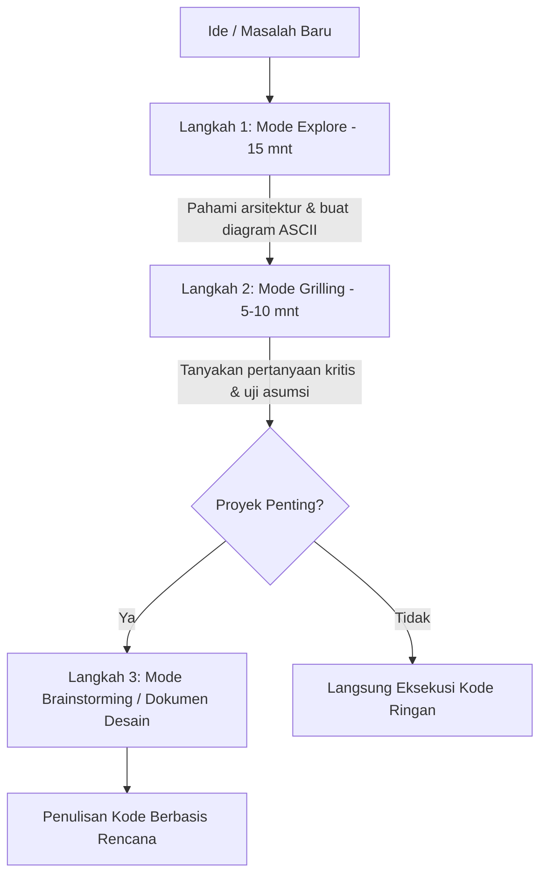

# 🎬 Desain Isolasi dalam AI Programming: Bedah Framework Grill-me, Superpowers, dan OpenSpec

> **URL Video**: [https://www.youtube.com/watch?v=O6D7dMQylhU](https://www.youtube.com/watch?v=O6D7dMQylhU)  
> **Judul Asli**: 你的AI编程总是翻车？因为你少做了一步：设计隔离 | 拆解 Grill-me，Superpowers，Openspec 的第一步  
> **Kanal**: Why QQ  
> **Durasi**: 15:12  
> **Kata Kunci**: `#AI-Programming` `#Design-Isolation` `#Grill-me` `#Superpowers` `#OpenSpec` `#Obsidian`

---

## 📌 Ringkasan Eksekutif & Konsep Utama

Banyak pengembang mengeluh bahwa kode yang dihasilkan oleh AI (seperti Cursor, Claude Code, Antigravity, dll.) sering kali "hampir benar tapi gagal di akhir" (*zonk* / 翻车). Masalah utamanya **bukan pada kemampuan AI menghasilkan kode**, melainkan pada **kurangnya tahap perencanaan dan isolasi desain sebelum menulis kode**.

Jika kebutuhan Anda masih kabur, alat AI terbaik pun hanya akan memproduksi kode salah dengan sangat cepat. Tahap perencanaan bertujuan untuk memastikan kita **mengajukan pertanyaan yang benar**, bukan mendapatkan jawaban yang salah dengan cepat.

Video ini membedah 3 framework/skill perencanaan AI terkemuka:
1. **Matt Pocock - `grill-me` (`/grilling`)**
2. **Jesse Vincent (Obra) - `Superpowers` (Brainstorming)**
3. **OpenSpec - `Explore` (`openspec-explore`)**

---

## ⚔️ Perbandingan 3 Framework Perencanaan AI

| Dimensi | Matt Pocock (`grill-me`) | Jesse Vincent (`Superpowers`) | OpenSpec (`Explore`) |
| :--- | :--- | :--- | :--- |
| **Peran AI** | Pewawancara Kritis / Interrogator | Manajer Proyek Ketat | Mitra Berpikir / Thinking Partner |
| **Gaya Alur Kerja** | Tanya jawab satu per satu secara interaktif | Checklist ketat 9 langkah (*Strict Workflow*) | Fleksibel, analisis masalah & diagram ASCII |
| **Output Utama** | Pemahaman bersama via percakapan | Dokumen Desain tertulis & Rencana Tindakan | Pemetaan arsitektur & opsi *trade-off* |
| **Visualisasi** | Murni teks percakapan | *Visual Companion* (opsional via browser) | Diagram ASCII cepat |
| **Cocok Untuk** | Validasi ide cepat (5–10 menit) | Proyek penting, tim, & pemeliharaan jangka panjang | Memahami sistem kompleks / *legacy code* |

---

## 🧠 Filosofi & Perincian Framework

### 1. Matt Pocock: `grill-me` (`/grilling`)
* **Filosofi**: *Tekanan Pertanyaan Berturut-turut (Pressure-test Interview)*.
* **Cara Kerja**: AI berpura-pura menjadi pewawancara teknis yang kritis. AI akan menanyakan Detail Arsitektur, batas kapasitas, sinkronisasi data, dan penanganan kegagalan satu demi satu.
* **Kelebihan**: Cepat membedah asumsi implisit dalam pikiran Anda.
* **Kekurangan**: Tidak mewajibkan dokumen tertulis, sehingga keputusan desain sulit ditelusuri kembali 6 bulan kemudian.

### 2. Jesse Vincent (Obra): `Superpowers` (`Brainstorming`)
* **Filosofi**: *Isolasi Desain & Integritas Proses (Design Isolation)*.
* **Prinsip Utama**: **Tidak ada proyek yang terlalu sederhana untuk melewati desain**.
* **Alur 9 Langkah**:
  1. Eksplorasi konteks proyek.
  2. Gunakan *Visual Companion* (jika memerlukan visualisasi UI/diagram).
  3. Klasifikasi pertanyaan klarifikasi.
  4. Berikan 2–3 alternatif solusi.
  5. Tampilkan desain akhir & minta konfirmasi pengguna.
  6. Tulis ke dalam Dokumen Desain formal.
  7. Lakukan Self-Review.
  8. Minta User Review.
  9. Masuk ke `writing-plans` (rencana eksekusi kode).
* **Keunggulan**: Memastikan modul terisolasi (*clean boundaries*), mencegah perubahan di satu modul merusak bagian lain.

### 3. OpenSpec: `Explore` (`openspec-explore`)
* **Filosofi**: *Dukungan Kognitif & Eksplorasi Fleksibel*.
* **Cara Kerja**: Sebelum terburu-buru membuat proposal/modifikasi kode, AI membaca *codebase*, menggambar diagram ASCII untuk struktur sistem, dan menimbang *trade-off*.
* **Keunggulan**: Sangat membantu ketika berhadapan dengan *legacy code* yang rumit tanpa arah yang jelas.

---

## 💡 Alur Kerja Hibrida Terbaik (Rekomendasi Praktis)

Gabungkan keunggulan ketiga framework sesuai kebutuhan:

1. **Eksplorasi (15–20 Menit)**: Gunakan mode **Explore** untuk membedah masalah awal dan membuat gambaran kasar (ASCII diagram).
2. **Uji Ketahanan (5–10 Menit)**: Gunakan mode **Grilling** untuk menjawab pertanyaan tajam dan menemukan celah tersembunyi.
3. **Dokumentasi (Proyek Utama)**: Gunakan alur **Brainstorming** untuk menghasilkan Dokumen Desain tertulis sebelum menulis baris kode pertama.

---

## 📺 Cara Menonton Video YouTube Bahasa China dengan Subtitel Bahasa Indonesia

Jika Anda ingin menonton langsung video ini di YouTube dengan terjemahan Bahasa Indonesia:

1. **Fitur Auto-Translate Bawaan YouTube (Desktop/Browser)**:
   - Buka video: [YouTube Link](https://www.youtube.com/watch?v=O6D7dMQylhU).
   - Klik tombol **CC / Subtitle** di pojok kanan bawah player.
   - Klik ikon **Pengaturan (Gerigi/Settings)** $\rightarrow$ **Subtitles/CC**.
   - Pilih **Auto-translate (Terjemahkan Otomatis)** $\rightarrow$ Pilih **Indonesian (Bahasa Indonesia)**.

2. **Menggunakan Ekstensi Browser Dual Subtitles**:
   - Pasang ekstensi Chrome/Firefox seperti **YouTube Dual Subtitles**, **Trancy**, atau **Immersive Translate**.
   - Ekstensi ini akan menampilkan dua bahasa sekaligus (Mandarin asli + Indonesia) secara bersampingan di player.

---

## 📝 Transkrip Lengkap Video (Bahasa Indonesia)

<b>Klik di sini untuk membongkar Transkrip Lengkap per Stempel Waktu (00:00 - 15:12)</b>

### [00:00 - 02:00] Pendahuluan & Pengenalan 3 Framework
* **[00:00]**: Halo semuanya, saya QQ. Pernahkah Anda berpikir mengapa beberapa insinyur dapat dengan cepat mengubah ide samar menjadi desain yang jelas, sementara yang lain terjebak dalam diskusi tak berujung pada tahap perencanaan? Masalahnya bukan pada tingkat kecerdasan mereka, tetapi pada alat perencanaan yang mereka gunakan.
* **[00:26]**: Hari ini saya akan membahas tiga skill dan alur kerja perencanaan yang sangat representatif baru-baru ini: `grill-me` dari Matt Pocock, `Brainstorming` dari Superpowers, dan `Explore` dari OpenSpec.
* **[01:00]**: Ketiganya lahir dengan latar belakang yang sama: Di era AI, alat pembuat kode makin kuat, tetapi jika kebutuhan Anda sendiri tidak jelas, pembuat kode sejago apa pun tidak bisa membantu Anda. Oleh karena itu, tahap perencanaan menjadi lebih penting dari sebelumnya.
* **[01:27]**: Perbedaan mendasar dari ketiga framework ini terletak pada tingkat ketatnya alur kerja (*workflow strictness*).

### [02:01 - 04:30] Bedah Detail: Grill-me & Superpowers Checklist
* **[02:01]**: `Grilling` dari Matt adalah yang paling ringan. Intinya sederhana: biarkan AI berperan sebagai pewawancara yang mengajukan pertanyaan berturut-turut hingga Anda dan AI mencapai pemahaman bersama.
* **[02:34]**: `Superpowers Brainstorming` memiliki 9 langkah checklist. Filosofinya: Tidak ada proyek yang terlalu sederhana untuk tidak membutuhkan desain. Bahkan untuk daftar To-Do sederhana, Anda harus menyelesaikan seluruh prosesnya.
* **[03:03]**: Brainstorming sangat menekankan prinsip **"Desain Isolasi dan Kejelasan"** (Design Isolation). Setiap bagian sistem harus memiliki tujuan yang jelas dan berkomunikasi melalui antarmuka (*interface*) terdefinisi.
* **[03:34]**: Brainstorming juga dapat menyediakan *Visual Companion* di browser untuk menampilkan diagram saat diperlukan.

### [04:31 - 09:50] OpenSpec Explore & Perbandingan Filosofi Rekayasa
* **[04:35]**: OpenSpec `Explore` bertindak sebagai mitra berpikir (*Thinking Partner*). Fokusnya bukan langsung menghasilkan dokumen proposal, melainkan memahami masalah, membaca kode, dan menggambar diagram ASCII.
* **[07:00]**: Perbandingan 3 filosofi rekayasa:
  - **Grilling**: Filosofi pragmatis / verifikasi cepat.
  - **Brainstorming**: Filosofi manajemen proses yang menjamin integritas lewat langkah-langkah ketat.
  - **Explore**: Filosofi dukungan kognitif yang memicu cara berpikir elastis.

### [09:51 - 13:00] Merancang Alat Perencanaan AI Ideal & Workflow Hibrida
* **[10:40]**: Jika kita merancang alat perencanaan ideal, ia harus mampu mengenali pintu masuk pengguna: Ide abstrak $\rightarrow$ Mode Explore; Rencana awal $\rightarrow$ Mode Grilling; Masalah arsitektur kompleks $\rightarrow$ Mode Brainstorming.
* **[12:41]**: Dalam praktik nyata, metode paling efektif adalah menggabungkan ketiga kerangka kerja ini:
  1. *Explore* (15-20 mnt) untuk berpikir mendalam & diagram ASCII.
  2. *Grilling* (5-10 mnt) untuk menguji ketahanan asumsi.
  3. *Brainstorming* untuk dokumen desain formal jika proyek penting.

### [13:01 - 15:12] Kesimpulan & Saran Praktis
* **[13:19]**: Keuntungan metode hibrida: Cepat, Mendalam, dan Lengkap. Jangan melakukan *over-design*. Tujuan tahap perencanaan adalah menemukan masalah utama dan mengambil keputusan penting.
* **[14:01]**: Di era AI, nilai utama tahap perencanaan adalah **memastikan kita mengajukan pertanyaan yang benar**, bukan mendapatkan jawaban salah dengan cepat.
* **[14:41]**: Gunakan Grilling untuk proyek personal/kecil; gunakan Explore saat berhadapan dengan sistem lama yang berantakan; ikuti proses Brainstorming dengan jujur saat menggarap bisnis inti perusahaan.

---
*Catatan dibuat otomatis oleh Antigravity Assistant untuk Obsidian Vault.*
