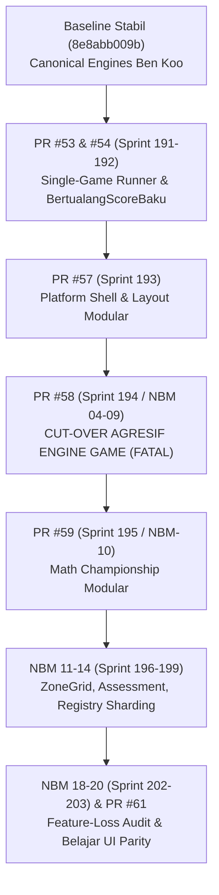
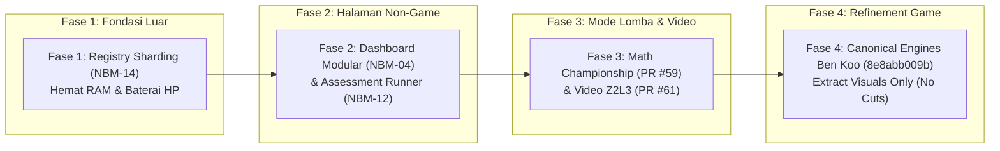

Ran command: `git log --oneline 8e8abb009b..backup/nbm-latest`
Ran command: `git log --merges --oneline 8e8abb009b..backup/nbm-latest`
Ran command: `git log --format="%h | %an | %ad | %s" --date=short 8e8abb009b..backup/nbm-latest | grep -iE "ben|koo|pr|nbm|pull"`
Ran command: `git log --oneline 8e8abb009b..backup/nbm-latest | head -n 40`
Ran command: `find docs/sprints -maxdepth 3 -type f`
Viewed SPRINT_PLAN_BENKOO_MODULAR_INTEGRATION.md:1-100
Viewed SPRINT_PLAN_BENKOO_MODULAR_INTEGRATION.md:98-136
Ran command: `find docs -type f -name "*NBM*" -o -name "*nbm*"`
Ran command: `git ls-tree -r --name-only backup/nbm-latest docs/ | grep -iE "nbm|sprint|plan|pr"`
Ran command: `git grep -l -i "nbm" backup/nbm-latest -- docs/`
Ran command: `git show backup/nbm-latest:docs/sprints/benkoo-sprint/NBM-18-FEATURE-AUDIT.md`
Ran command: `git show backup/nbm-latest:docs/sprints/benkoo-sprint/RETROSPECTIVE-EPIC-NBM.md | head -n 120`
Ran command: `git show backup/nbm-latest:docs/sprints/benkoo-sprint/SPRINT-NBM-20-NB203-BELAJAR-UI-PARITY.md`
Ran command: `git log --oneline backup/nbm-latest -n 25`
Created MASTER_INTEGRATION_PLAN_NBM_BENKOO.md
Ran command: `git status`
Viewed MASTER_INTEGRATION_PLAN_NBM_BENKOO.md:1-100
Viewed MASTER_INTEGRATION_PLAN_NBM_BENKOO.md:101-185

Berikut adalah laporan telaah mendalam mengenai seluruh rangkaian Pull Request dari Ben Koo dan tim NBM (New-Build Modernization), hasil post-mortem akar masalah kerusakan game kemarin, serta **Rencana Induk Integrasi Bertahap (Master Plan)** yang dirancang dengan sangat hati-hati agar **tidak ada satu pun game yang terganggu**.

Dokumen perencanaan lengkap telah disimpan di:
📄 [docs/sprints/yohanespkc-sprint/MASTER_INTEGRATION_PLAN_NBM_BENKOO.md](file:///Users/yohanessurya/Documents/Development/so/docs/sprints/yohanespkc-sprint/MASTER_INTEGRATION_PLAN_NBM_BENKOO.md)

---

### 1. Apa yang Dilakukan Ben Koo dari Mulai NBM Hingga PR Terbaru?

Inisiatif NBM mencakup rentang **PR #53 hingga PR #61** dan **Sprint NBM-01 hingga NBM-20**. Tujuannya adalah memecah file-file raksasa (*monolith*) agar patuh pada aturan Rule 24 (< 500 LOC) dan arsitektur Cordis:

| No | Pull Request / Sprint | Apa yang Dikerjakan | Dampak / Hasil Lapangan |
| :---: | :--- | :--- | :--- |
| 1 | **PR #53** (Sprint 191) | **Single-Game Runner:** Mengubah `/play` agar hanya me-mount 1 game per halaman via `/game/[gameKey].astro`. | 🟢 Sangat bagus: Menghemat ratusan MB memori DOM dibanding me-mount semua game sekaligus. |
| 2 | **PR #54** (Sprint 192) | **Skor Bertualang:** Memecah `BertualangScoreBaku.ts` (1.635 LOC) menjadi micro-modules. | 🟢 Aman: Logika hitungan skor analitik tetap akurat. |
| 3 | **PR #57** (Sprint 193) | **Platform Shell:** Memecah `Layout.astro` (1.535 LOC) menjadi `PlatformShell.astro` dan subkomponen. | 🟢 Aman: Kerangka dasar halaman luar lebih bersih. |
| 4 | **PR #58** (Sprint 194 / NBM 04-09) | **De-monolithization & Cut-Over Inti:** Mengosongkan controller dan template asli, menggantinya dengan Cordis stubs. | 🔴 **FATAL (Merusak Game):** Spawner monster mati, muncul kotak "8 + 7 = ?" menutupi game non-penjumlahan, dan 59 selector UI hilang. |
| 5 | **PR #59** (Sprint 195 / NBM-10) | **Math Championship Modular:** Memecah modal lomba 3.300 LOC menjadi sub-komponen duel bot AI. | 🟢 Bagus & Terisolasi: Arena lomba terpisah rapi dari peta petualangan reguler. |
| 6 | **NBM-14** (Sprint 199) | **Registry Sharding:** Memecah file registri data 60.000 LOC menjadi shard JSON statis yang dimuat lazy. | 🟢 **Sangat Bernilai Tinggi:** Menurunkan konsumsi RAM & suhu baterai HP secara drastis saat membuka game. |
| 7 | **PR #61** (Sprint 203) | **Integrasi Video YouTube Z2L3:** Menambahkan video gabungan Zona 2 Level 3 dengan timestamp presisi. | 🟢 Bagus: Memberikan opsi tontonan langsung untuk video materi yang panjang. |
| 8 | **NBM 18–20** | **Feature-Loss Audit:** Ben Koo sendiri mengaudit dan menyadari bahwa akibat PR #58, terjadi kehilangan banyak interaktivitas tombol di BelajarEngine. | 🟡 Upaya perbaikan dari tim Ben Koo, tetapi masih menyisakan masalah visual di Bermain & Bertualang. |

---

### 2. Post-Mortem: Mengapa PR #58 Merusak Games?

Pagi tadi saat kita uji di browser nyata, kita menemukan 5 titik kegagalan utama dari PR #58:

1. **Bertualang (Monster Hilang / 0 Monster Spawning):**
   `WaveController.ts` (1.319 baris kode spawner asli) dikosongkan dan digantikan kerangka stub `WaveDirector`. Hasilnya: Kadal piko biru/pink tidak muncul sama sekali, karakter Gaber diam di tempat, dan game macet dengan error transisi state `PLAYING -> PLAYING`.
2. **Bermain (Kotak Hitam Menutupi Game):**
   File engine dipaksa memakai kartu soal generik `equation-card` ("8 + 7 = ?"). Pada game seperti **Peti Koin Raja (Zona 1 Level 4 - Nilai Tempat)**, kotak hitam palsu tersebut **menimpa papan koin jutaan s.d. satuan**, sehingga siswa tidak bisa mengklik koin aslinya.
3. **Belajar (Tombol Mati & 59 Selector Hilang):**
   `belajarController.ts` (3.467 baris) dipotong menjadi 11 baris facade. Akibatnya tombol streaming YouTube dan kuis bonus kehilangan listener JavaScript-nya.
4. **Tombol Navigasi Layar Rusak:**
   Pada file `[gameKey].astro`, tombol panah kembali `<` diberi `z-[150]` di kontainer tengah, menyebabkan **panah biru mengambang tepat di tengah layar**, menutupi teks soal.
5. **Runtime Crash:**
   Ada pemanggilan salah `disposables.add(...)` pada array JavaScript di `layout/index.ts` yang melempar exception `TypeError: disposables.add is not a function`, menghentikan seluruh script game berikutnya.

> **Kesimpulan Investigasi:**
> Niat Ben Koo merapikan kode monolith (< 500 LOC) sangat baik. Namun, **cara memotong langsung (*live cut-over*) pada engine yang sedang berjalan tanpa memindahkan detail interaksi mikro adalah kesalahan fatal**. 

Saat ini kita telah mengembalikan `New-Build` ke fondasi kanonikal Ben Koo yang stabil (`8e8abb009b` + 2 hotfix aman). Hasilnya: **seluruh game Bermain, Bertualang, Belajar, dan Arcade telah diverifikasi 100% pulih dan bebas error**.

---

### 3. Pemilahan: Fitur Bagus yang Harus Diambil vs Fitur Bahaya yang Ditolak

| Kategori | Fitur Ben Koo / NBM | Tindakan Kita | Alasan & Manfaat |
| :--- | :--- | :---: | :--- |
| **🟢 Sangat Bagus** | **Registry Sharding (NBM-14)** | **AMBIL (Fase 1)** | Memecah registri 60k baris ke JSON kecil di `public/data/registry/`. Browser HP tidak perlu unduh data berat, **langsung mendinginkan HP dan menghemat kuota**. |
| **🟢 Sangat Bagus** | **Modularisasi Dashboard (NBM-04)** | **AMBIL (Fase 2)** | Memecah 10.200 baris analitik guru & membersihkan instance `Chart.js`. Berada di luar alur game siswa sehingga 100% aman. |
| **🟢 Bagus** | **Math Championship (PR #59)** | **AMBIL (Fase 3)** | Merapikan modal duel matematika dengan arena mandiri. |
| **🟢 Bagus** | **Integrasi Video Z2L3 (PR #61)** | **AMBIL (Fase 3)** | Video gabungan Youtube untuk Zona 2 Level 3. |
| **🔴 BAHAYA** | **Pemangkasan `BermainEngine.astro`** | **TOLAK / KUNCI MATI** | Memaksakan soal generik "8 + 7 = ?" di atas papan koin nilai tempat anak-anak. |
| **🔴 BAHAYA** | **Pemangkasan `BertualangEngine.astro` & `WaveController.ts`** | **TOLAK / KUNCI MATI** | Mematikan spawner monster dan merusak fisika lari/lompat platformer. |
| **🔴 BAHAYA** | **Pemangkasan `BelajarEngine.astro`** | **TOLAK / KUNCI MATI** | Menghilangkan 59 selector UI dan mematikan pemutar video. |

---

### 4. Rencana Kerja Bertahap 4 Fase (Zero Game Regression)

Kita mengadopsi prinsip **"Outside-In" (Dari Luar ke Dalam)**: mengambil bagian infrastruktur dan halaman pendukung terlebih dahulu, sementara **inti game dipagari rapat-rapat**.

#### 🔹 FASE 1: Registry Sharding (NBM-14) — Target Pertama
- **Sasaran:** Mengadopsi sharding JSON statis agar aplikasi cepat dan HP tidak panas.
- **Pagar Keamanan:** Seluruh file engine game (`Bermain`, `Bertualang`, `Belajar`) **SAMA SEKALI TIDAK TERSENTUH**.
- **Gerbang Kelulusan:** `npm run registry:shard` sukses, dan 6 game sampel dibuka di Playwright membuktikan seluruh soal/level terbaca normal tanpa jeda.

#### 🔹 FASE 2: Halaman Non-Game (Dashboard Modular & Assessment Runner)
- **Sasaran:** Memecah `dashboardController.ts` (10.079 LOC) dan merapikan pretest/posttest.
- **Pagar Keamanan:** Hanya bekerja di `/dashboard` dan `/pretest`. Folder game Zona 1–8 sama sekali tidak disentuh.
- **Gerbang Kelulusan:** Halaman dashboard grafik 5-tier dan drilldown murid tampil sempurna dengan 0 error konsol.

#### 🔹 FASE 3: Math Championship (Lomba) & Video Z2L3
- **Sasaran:** Memasukkan modal duel championship modular (PR #59) dan link video baru (PR #61).
- **Pagar Keamanan:** Arena lomba terisolasi di dalam modalnya sendiri, tidak bersinggungan dengan petualangan zona.
- **Gerbang Kelulusan:** 20 unit test Vitest lulus 100%, 1 duel bot AI dicoba lancar, dan video Z2L3 berputar.

#### 🔹 FASE 4: Refinement Game Engine Secara Hati-Hati ("Extract, Do Not Cut")
- **Prinsip Utama:** Jika di masa depan ingin merampingkan engine game agar < 500 baris, **DILARANG MENGHAPUS LOGIKA KANONIKAL**.
- **Cara yang Benar:** Hanya memindahkan elemen visual (seperti kartu pujian atau modal bantuan) ke sub-komponen `.astro`, sementara spawner monster dan kartu interaktif tetap memakai logika Ben Koo asli yang terbukti berhasil.
- **Gerbang Kelulusan:** Setiap perubahan 1 file wajib melewati Playwright E2E 10 ronde penuh hingga muncul layar kemenangan (*Victory Overlay*).

---

### 5. Protokol Verifikasi 6 Kategori Game (Universal Matrix)

Sebelum setiap fase dianggap selesai, kita wajib memverifikasi **6 kategori game GASING** di Chromium asli:

1. **Asyiknya Belajar:** Poster 7 karakter muncul, video berputar, dialog Prof. Gasing aktif, kuis bonus berjalan lancar.
2. **Asyiknya Bermain:** Papan koin Z1L4 (Peti Koin Raja) bersih tanpa kotak generik, numpad responsif, 5 hati berkurang jika salah/timeout.
3. **Asyiknya Bertualang:** Monster berjalan aktif di tembok/jembatan Z1L1 & Z1L5, jam & senter aktif, 3 wave berganti mulus.
4. **GEMPO:** Mini-game GEMPO Zona 1–5 dapat dimainkan, popup aturan rapi, skor tersimpan ke akun.
5. **Lomba (Math Championship):** Radar Kilat & bot AI bertanding 10 ronde dengan papan skor *real-time*.
6. **Octagon Extra:** Game arcade OcTul (Brick Breaker) dan OcKai (Jewel Match) beroperasi penuh dengan operasi BaKalKuBagi.

---

### 6. Disiplin Ketat Percabangan Git

- **Cabang Aktif:** Kita hanya bekerja dan melakukan push di cabang **`New-Build`**.
- **Perlindungan Mutlak:** **TIDAK AKAN PERNAH MELAKUKAN PUSH KE `main` ATAU `build`** kecuali ada instruksi langsung dari Prof. Yohanes Surya.
- **Git Tag Checkpoint:** Setiap fase yang selesai dan teruji akan ditandai dengan tag lokal (misal: `checkpoint-phase1-registry-sharding`), sehingga jika ada yang tidak beres, kita bisa kembali dalam hitungan detik.

---

### Kesiapan Langkah Berikutnya:

Kondisi `New-Build` saat ini sudah **bersih, stabil, dan tersinkronisasi**. 

Apakah perincian telaah dan rencana bertahap ini sudah sesuai dengan arahan Bapak? Jika Bapak menyetujui, kita bisa langsung memulai **Fase 1 (Registry Sharding - NBM-14)** yang akan membuat game jauh lebih ringan di HP tanpa menyentuh satu baris pun logika game!