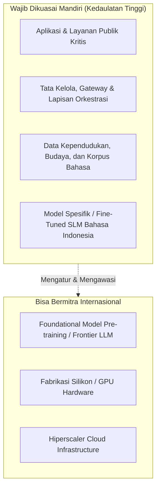

Searched web: ""Jeen AI" OR "jeen.ai" enterprise platform"

Ya, saya tahu **Jeen AI** (`jeen.ai`).

Berikut adalah profil komprehensif mengenai **Jeen AI**, konteks strategis pertemuan, serta **analisis dan panduan jawaban terstruktur** untuk membedah seluruh poin *Discussion Note* bagi kepentingan **GovTech Indonesia, InaAI, dan PKC (Pusat Kecerdasan Buatan / Prof. Yohanes Surya)**.

---

### Profil Ringkas: Apa itu Jeen AI?

* **Kategori & Posisi Pasar:** Jeen AI adalah platform **Enterprise AI Operating Layer / Control Plane (Orchestration & Governance)**. Mereka bukan perusahaan yang melatih model fondasi (bukan pembuat LLM seperti OpenAI atau Anthropic), melainkan penyedia *infrastructure-agnostic orchestration layer* yang menghubungkan berbagai model AI dengan data, alur kerja (*workflows*), dan regulasi keamanan perusahaan/pemerintah.
* **Fitur Utama:**
  1. **Jeen Workspace:** Antarmuka kolaboratif yang aman (*role-based access*) untuk pegawai/institusi.
  2. **Agent Factory:** Mesin perancang agen AI otonom (*multi-agent workflows*) yang terintegrasi dengan API dan *database* internal.
  3. **AI Governance & FinOps:** Pengawasan biaya token (*cost tracking* antar-departemen), sensor *guardrails* (pencegahan *prompt injection*, masking data sensitif/PII), serta *audit log* forensik.
  4. **Pilihan Deployment Fleksibel:** Mendukung *Multi-Cloud*, *Hybrid*, *On-Premise*, hingga **Full Air-Gapped (tanpa koneksi internet publik)**.
* **Latar Belakang & DNA Perusahaan:** Berbasis di Tel Aviv-Yafo, Israel (rebranding dari entitas teknologi publik/Micronet Ltd. pada akhir 2024–2025). DNA teknologinya kental dengan standar *cybersecurity* dan kedaulatan data tingkat *defense/intelligence-grade*, yang dirancang agar organisasi dapat menggunakan AI tanpa membocorkan data ke penyedia model global.

---

# Analisis Strategis & Panduan Jawaban Diskusi

Dokumen ini disusun sebagai panduan strategis bagi delegasi Indonesia (**GovTech Indonesia, InaAI, PKC**) dalam memimpin jalannya diskusi dan menguji kapabilitas Jeen AI.

---

## BAGIAN I: Lanskap AI Global (Poin 1 – 4)

### 1. Perubahan Terpenting 3–5 Tahun ke Depan & Nilai Ekonomi Terbesar
* **Pergeseran Paradigma:** Dari sekadar *Chatbot/RAG* pasif menuju **Agentic Workflows** (agen otonom yang bisa mengeksekusi aksi: memanggil API, memvalidasi data antar-sistem, membuat keputusan terstruktur) dan **Physical AI / Edge AI**.
* **Model Fondasi vs. Model Spesifik:** Era perang ukuran parameter (1T+ parameter) mulai mengalami *diminishing returns* karena batas data pelatihan dan biaya komputasi. Tren beralih ke **SLM (Small Language Models, 3B–14B)** dengan *fine-tuning* domain spesifik yang jauh lebih murah, hemat energi, dan bisa dijalankan *on-premise*.
* **Sumber Nilai Ekonomi Terbesar:** Bukan pada pemilik model fondasi (yang marginnya tertekan biaya infrastruktur), melainkan pada **lapisan orkestrasi dan aplikasi vertikal** yang berhasil mengotomasi birokrasi pemerintahan (*GovTech*), rantai pasok, layanan kesehatan publik, dan personalisasi edukasi massal.

### 2. Hambatan Utama Adopsi Skala Besar
* **Trust & Security (Kepercayaan):** Risiko halusinasi, kebocoran data rahasia/PII ke *cloud* asing, dan ketidakjelasan akuntabilitas keputusan agen AI.
* **Energy & Infrastructure (Energi & Komputasi):** Keterbatasan suplai daya listrik (*grid capacity*) untuk *data center* AI dan kelangkaan GPU tier-1 (Nvidia Blackwell/Hopper).
* **Integration & Data Readiness:** Data pemerintah dan korporasi masih terfragmentasi (*siloed*), tidak terstruktur, dan tidak siap di-*ingest* oleh agen AI.

### 3. Komparasi AS vs. China
| Dimensi | Amerika Serikat (AS) | China |
| :--- | :--- | :--- |
| **Model & Riset** | Unggul di *frontier proprietary models* (GPT-5/Claude/Gemini) dan arsitektur baru. | Unggul di ekosistem *open-weights* (Qwen, DeepSeek) dengan efisiensi inferensi tinggi. |
| **Hardware & Chip** | Monopoli desain GPU (Nvidia/AMD), EDA tools, dan arsitektur akselerator. | Mengembangkan kemandirian via SMIC, Huawei Ascend; unggul di manufaktur perangkat keras massal. |
| **Adopsi Nyata** | Kuat di sektor SaaS enterprise, finansial, dan biomedis. | Sangat masif dan cepat di *smart cities*, otomasi industri, logistik, dan layanan publik digital. |
| **Proyeksi Kepemimpinan** | Memimpin di batas inovasi kognitif (*frontier reasoning*). | Memimpin di skalabilitas biaya rendah, ketersediaan energi, dan adopsi industri nyata. |

### 4. Posisi Indonesia di Antara AS & China
* **Posisi Non-Blok Digital (Strategic Non-Alignment):** Indonesia tidak boleh terikat (*vendor lock-in*) secara eksklusif ke ekosistem AS ataupun China. 
* **Dampak Pembatasan Geopolitik:** Larangan ekspor chip canggih AS dan regulasi keamanan data memperkuat keharusan Indonesia memiliki arsitektur yang **model-agnostic**—sistem nasional yang dapat mengganti model fondasi kapan saja (misal: beralih dari model AS ke model terbuka lokal/China) tanpa mengubah arsitektur aplikasi di atasnya.

---

## BAGIAN II: Keamanan & Tata Kelola AI (Poin 5 – 6)

### 5. Risiko Keamanan yang Wajib Diprioritaskan (Era AI Agent)
> [!WARNING]
> Ketika AI bergeser dari "memberi saran teks" menjadi "mengambil tindakan otonom", permukaan serangan (*attack surface*) berlipat ganda.

1. **Privilege Escalation & Indirect Prompt Injection:** Serangan di mana dokumen/data eksternal yang diolah agen berisi instruksi tersembunyi untuk mentransfer dana, mengubah status hak akses database, atau menghapus berkas.
2. **Cascading Failures:** Kesalahan logika satu agen otonom yang merambat ke agen lain dalam alur kerja antar-kementerian.
3. **Data Exfiltration:** Agen AI yang secara tidak sengaja mengirimkan data intelijen atau NIK warga negara ke server API model fondasi di luar negeri.

### 6. Melindungi Data Sensitif Sembari Memanfaatkan AI Global
* **Pola Arsitektur Hybrid Sovereign:**
  * **Layer 1 (Lokal / Air-Gapped):** Data sensitif, identitas kependudukan, dan data pertahanan diproses di server lokal di Indonesia menggunakan *Open-Source Sovereign Models* (misal: Llama/Qwen yang di-*fine-tune* untuk Bahasa Indonesia & hukum lokal).
  * **Layer 2 (Sovereign Gateway with Data Sanitization):** Jika memerlukan model *frontier* global (OpenAI/Anthropic) untuk penalaran kompleks, semua data wajib melalui *gateway sanitasi* lokal yang secara otomatis membuang/mengaburkan PII (*personally identifiable information*) sebelum *prompt* meninggalkan yurisdiksi Indonesia.

---

## BAGIAN III: Kedaulatan Teknologi & Peluang Indonesia (Poin 7 – 10)

### 7. Keunggulan Kompetitif Realistis Indonesia
* **Skala Pasar & Data Demografis Unik:** 280 juta penduduk dengan keberagaman bahasa daerah, data biodiversitas tropis, data maritim, serta pola interaksi digital unik yang tidak dimiliki negara Barat.
* **Leapfrogging GovTech:** Kebutuhan konsolidasi ribuan aplikasi pemerintah (*SPBE*) menjadi platform terpadu (INA Digital) adalah kanvas terbesar di Asia Tenggara untuk penerapan agen AI birokrasi.
* **Bakat Pemuda & Komputasi Efisien:** Indonesia tidak butuh miliaran dolar untuk melatih model dari nol jika memiliki talenta yang mahir dalam *fine-tuning*, kompresi model (kuantisasi), dan pembuatan alur kerja orkestrasi yang efisien.

### 8. Indonesia sebagai AI Hub: Hub Jenis Apa?
* **Bukan Compute Hub (Pusat Server Mentah):** Bersaing menjadi *compute hub* mentah sulit melawan Malaysia (Johor) atau Singapura yang memiliki ekosistem listrik/pendinginan lebih dulu terbangun.
* **Menjadi "AI Application & Sovereign Solution Hub for the Global South":**
  * Pusat keunggulan regional untuk implementasi AI di sektor **Pemerintahan Digital (GovTech)**, **Literasi & Pendidikan Dasar (GASING AI / Personalized Learning)**, dan **Pertanian Tropis / Ketahanan Pangan**.
  * **Indikator Keberhasilan:** Bukan jumlah server GPU, melainkan persentase efisiensi layanan publik, kecepatan pembuatan kebijakan berbasis data, serta rasio kemandirian lisensi (*indigenous tech stack*).

### 9. Bagian AI Stack yang WAJIB Dikuasai Mandiri

1. **Wajib Mandiri:**
   * **Data & Knowledge Stores:** Database vektor dan korpus data nasional harus berada di yurisdiksi hukum Indonesia.
   * **Control Plane / Orchestration Gateway:** "Saklar utama" pengatur hak akses, auditing, dan perutean (*routing*) model tidak boleh berada di tangan vendor tunggal.
   * **Model Domain Khusus:** Model bahasa hukum, bahasa Indonesia/daerah, dan administrasi negara.
2. **Bermitra:**
   * Pengadaan *hardware* akselerator (GPU) dan infrastruktur komputasi mentah.

### 10. Tiga Aksi Prioritas Indonesia Saat Ini
1. **Membangun InaAI National Sovereign Control Plane:** Menetapkan standar arsitektur tunggal bagi seluruh instansi pemerintah untuk orkestrasi AI—memastikan setiap dinas/kementerian tidak membeli platform AI secara serampangan dan terhindar dari *vendor lock-in*.
2. **Kurasi Korpus Pengetahuan Nasional & Bahasa:** Mengumpulkan dan menstandardisasi seluruh dokumen regulasi, kebudayaan, dan arsip negara untuk *fine-tuning* model nasional yang bebas bias eksternal.
3. **Penyelarasan Talenta Melalui Riset Aplikatif (PKC):** Mengarahkan Pusat Kecerdasan Buatan & Kreativitas untuk mencetak *AI system architects* dan *agent engineers* yang langsung ditempatkan pada proyek strategis nasional.

---

## BAGIAN IV: Menilai & Menguji Jeen AI (Poin 11 – 13)

Gunakan bagian ini untuk **menguji klaim Jeen AI** dalam pertemuan agar posisi tawar Indonesia tetap kuat:

### 11. Menguji Klaim "Proprietary" Jeen AI vs Kompetitor
* **Pertanyaan Kritis untuk Jeen:**
  > *"Banyak platform enterprise AI saat ini hanyalah 'wrapper' di atas LangChain, LlamaIndex, atau API cloud publik. Apa komponen intelektual yang benar-benar Anda buat sendiri (in-house IP)? Apakah mesin perutean agen, optimasi memori konteks, atau arsitektur guardrail-nya?"*
* **Kelebihan yang Ditawarkan Jeen:** Kemampuan *Air-Gapped Deployment* (bisa dipasang di data center lokal tanpa akses internet) dan integrasi *FinOps* instan antar-model.

### 12. Validasi Keamanan, Tata Kelola & Pengendalian Biaya
* **Pertanyaan Kritis untuk Jeen:**
  > *"Ketika kami mengintegrasikan model pihak ketiga atau agen eksternal, bagaimana Jeen menjamin bahwa embedding vector, metadata, dan business logic kami tidak dikirimkan sebagai telemetri ke server Jeen di luar negeri? Bisakah Anda menunjukkan audit trail forensik dari implementasi di pelanggan tingkat pertahanan atau perbankan Anda?"*

### 13. Rancangan Uji Coba (Pilot Project) di Indonesia
Jika pilot dijalankan bersama **GovTech / InaAI / PKC**, pilot harus memiliki parameter tegas:
* **Kasus Penggunaan Uji Coba:** Layanan Internal Administrasi ASN (misalnya: Agen Analisis Regulasi & Harmonisasi Peraturan Perundang-undangan atau Asisten Analisis Data Kebijakan).
* **Syarat Mutlak (Non-Negotiable):**
  1. *On-Premise / National Cloud Deployment* (data tidak boleh keluar dari wilayah NKRI).
  2. *Model Portability:* Sistem harus dibuktikan dapat berpindah dari satu LLM ke LLM lokal/terbuka (misal dari GPT-4o ke Llama-3-Indo) hanya dengan satu klik tanpa *downtime*.
  3. *Zero Telemetry Leakage:* Tidak ada pelaporan data kembali ke vendor.
  4. *Kriteria Keberhasilan Terukur:* Akurasi rujukan regulasi >95%, latensi respons <3 detik, reduksi biaya token >30% melalui perutean cerdas (*smart routing*).

---

## Rangkuman Sikap untuk Agenda Pertemuan

Dalam sesi presentasi dan diskusi:
* **Posisi InaAI & PKC:** Tampilkan bahwa Indonesia memiliki visi kedaulatan digital yang matang dan peta jalan yang jelas. 
* **Sikap terhadap Jeen AI:** Posisikan Jeen sebagai salah satu kandidat penyedia *software layer/enabler*, bukan pemilik sistem. Tuntut transparansi kode, kapabilitas *on-premise*, dan alih pengetahuan (*knowledge transfer*) kepada talenta rekayasa PKC dan GovTech Indonesia.