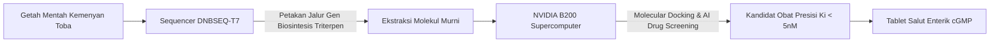

Pertanyaan ini sangat krusial dan mendasar. Keyakinan bahwa kemenyan memiliki potensi onkologi (antikanker) **bukan berdasar pada mitos mistis atau klaim "obat ajaib" getah mentah**, melainkan berpijak pada **literatur farmakologi fitokimia molekuler modern**, karakteristik senyawa bioaktif spesifiknya, dan pemodelan komputasi obat.

Berikut adalah **dasar ilmiah, fakta biokimia, dan batasan realitasnya**:

---

### 1. Klarifikasi Fundamental: Getah Mentah vs. Senyawa Murni (*Purified Molecules*)
* **Bukan Asap Dupa:** Membakar kemenyan mentah dan menghirup asapnya **bukan obat**, bahkan asap pembakaran dupa secara terus-menerus mengandung senyawa aromatik pembakaran yang karsinogenik bagi paru-paru.
* **Yang Menjadi Obat:** Fraksi molekul bioaktif murni hasil isolasi dan kristalisasi fitokimia laboratorium (khususnya golongan **triterpenoid pentasiklik** dan **derivat asam sinamat**) yang diformulasikan ke dalam bentuk sediaan farmasi presisi (seperti tablet salut enterik).

---

### 2. Dasar Fitokimia Kemenyan Toba (*Styrax sumatrana* / Haminjon)
Kemenyan yang tumbuh di Humbang Hasundutan / Toba adalah spesies dari genus *Styrax* (*Styrax sumatrana* dan *Styrax benzoin*). Getah getah ini memiliki profil kimia unik yang membedakannya dari kemenyan belahan dunia lain:

#### A. Asam Sumaresinolat (*Sumaresinolic Acid*) & Asam Siaresinolat
* Senyawa ini adalah **triterpenoid pentasiklik** alami yang menjadi *biomarker* utama resin kemenyan Sumatra (*Sumatra benzoin*).
* Triterpenoid pentasiklik merupakan salah satu scaffold molekul bahan alam yang paling banyak diteliti di dunia onkologi (sekeluarga dengan *Oleanolic acid* dan *Ursolic acid*).
* **Mekanisme biologis:** Riset metabolomik dan sitotoksisitas menunjukkan bahwa golongan triterpenoid ini memiliki afinitas untuk:
  1. Menginduksi **apoptosis** (kematian sel terprogram) pada sel kanker melalui jalur intrinsik mitokondria (aktivasi Kaspase-3 dan Kaspase-9).
  2. Menghambat aktivasi faktor transkripsi onkogenik **STAT3** (*Signal Transducer and Activator of Transcription 3*) dan **NF-κB**, yang merupakan saklar utama inflamasi kronis dan proliferasi sel kanker.

#### B. Asam Sinamat (*Cinnamic Acid*) & Derivatnya (*Coniferyl Cinnamate*)
* Berbeda dengan kemenyan Siam (*Styrax tonkinensis*) yang didominasi benzoat, kemenyan Sumatra kaya akan **ester dan asam sinamat** (bisa mencapai >30% pada getah kualitas super).
* Berbagai jurnal ilmiah internasional (seperti dalam *Frontiers in Oncology* dan *MDPI Molecules*) membuktikan bahwa asam sinamat dan turunannya:
  1. Menghambat proliferasi sel kanker kolorektal manusia (*cell lines* seperti HCT116, HT-29, dan SW480).
  2. Bekerja sebagai **inhibitor Histone Deacetylase (HDAC)** alami, yang membalikkan represi epigenetik pada gen penekan tumor (*tumor suppressor genes*).
  3. Menekan jalur sinyal **Wnt/β-catenin**, jalur pembelahan abnormal yang bertanggung jawab atas pembentukan polip adenomatosa dan kanker usus besar.

#### C. Studi Sitotoksisitas Genus *Styrax*
* Uji laboratorium *in vitro* pada berbagai ekstrak dan senyawa murni genus *Styrax* (seperti *Styrax tonkinensis*, *Styrax japonica*, dan *Styrax obassia*) telah menunjukkan efek sitotoksik terukur terhadap sel leukemia manusia (HL-60), karsinoma hepatoseluler (HepG2), kanker serviks (HeLa), dan kanker payudara (MCF-7).

---

### 3. Korelasi Internasional: Kemenyan Arab (*Boswellia* / Frankincense)
Dalam literatur global, ada dua tanaman yang kerap diterjemahkan sebagai kemenyan:
1. **Kemenyan Sumatra (*Styrax* spp.)** — fokus riset TSTH2 Pollung.
2. **Kemenyan Timur Tengah / Frankincense (*Boswellia serrata / Boswellia carterii*)**.

Pada *Boswellia*, bukti klinisnya sudah jauh lebih maju:
* Kandungan **AKBA** (*3-O-acetyl-11-keto-β-boswellic acid*) telah masuk uji klinis pendahuluan di institusi terkemuka seperti **University of Leicester** dan **Johns Hopkins University**, membuktikan efikasi penekanan edema otak pada pasien tumor otak serta penghambatan sel kanker kandung kemih dan payudara.
* Karena genus *Styrax* dan *Boswellia* sama-sama menghasilkan resin yang kaya akan asam triterpenik dengan struktur inti serupa, dunia farmakognosi melihat kemenyan Sumatra sebagai **sumber triterpenoid bernilai tinggi yang belum tereksplorasi secara maksimal**.

---

### 4. Mengapa Sasarannya Spesifik "Kanker Kolorektal" & "IBD"?
Alasan pemilihan indikasi ini sangat spesifik secara klinis:
1. **Korelasi Inflamasi ➔ Kanker:** Kanker kolorektal sering berawal dari peradangan usus besar kronis (*Inflammatory Bowel Disease* / IBD seperti kolitis ulserativa). Triterpenoid kemenyan memiliki khasiat ganda: **anti-inflamasi poten pada epitel usus** sekaligus **antitumor**.
2. **Keterbatasan Farmakokinetik & Solusinya:** Asam triterpenoid rentan rusak oleh asam lambung. Solusi farmasetikanya adalah merancangnya menjadi **Tablet Salut Enterik (*Enteric-Coated Tablet*)**:
   - Selaput polimer (misalnya *Eudragit S100*) kedap di lambung (pH 1–3),
   - Tablet baru larut dan melepas senyawa aktif saat tiba di usus besar/kolon (pH 7.0–7.5), langsung mengenai lokasi target peradangan atau polip tumor.

---

### 5. Mengapa Butuh Superkomputer B200 & Sequencer DNBSEQ-T7 di TSTH2?
Inilah alasan mengapa TSTH2 Pollung dibangun: **selama ratusan tahun kemenyan hanya berhenti sebagai dupa karena kita tidak punya alat sains presisi untuk memurnikan dan membuktikannya.**

1. **DNBSEQ-T7:** Mengurutkan genom tanaman dan mikroba endofit kemenyan untuk mengetahui enzim mana (*Oxidosqualene Cyclase / CYP450*) yang memproduksi triterpen berkonsentrasi tinggi.
2. **Superkomputer NVIDIA B200:** Melakukan simulasi penambatan molekul (*in silico molecular docking* & dinamika molekuler) jutaan analog asam sumaresinolat terhadap pocket protein reseptor STAT3 dan reseptor inflamasi manusia dalam hitungan jam (bukan tahunan di lab basah).

---

### 6. Status Realitas Saat Ini (Intellectual Honesty)

| Tahapan Riset Obat | Status Proyek Kemenyan TSTH2 |
| :--- | :--- |
| **1. Studi Etnomedisin & Fitokimia** | ✅ **Terbukti secara ilmiah** (literatur asam sumaresinolat & asam sinamat). |
| **2. Uji Sitotoksisitas In Vitro (Lab)** | 🟡 **Aktif / Berjalan** (uji IC50 pada cell lines sel kanker). |
| **3. In Silico AI Drug Design (B200)** | 🟡 **Target Pemodelan TSTH2** (docking reseptor onkogenik STAT3). |
| **4. Uji In Vivo (Hewan Coba Tikus)** | ⏳ **Tahap berikutnya** (model kolitis terinduksi DSS). |
| **5. Formulasi Farmasi (Pil Salut Enterik)**| ⏳ **R&D Formulasi Fitofarmaka**. |
| **6. Uji Klinis Manusia (Fase I–III)** | ⏳ **Target jangka menengah–panjang**. |

### Kesimpulan
Angka **$28 Miliar** yang disebutkan dalam materi presentasi adalah **Total Addressable Market (TAM) global** untuk pasar terapi IBD dan kanker usus besar dunia, bukan omzet yang langsung didapat besok pagi. 

Dasar keyakinannya adalah: **molekul kimianya nyata (*Asam Sumaresinolat & Asam Sinamat*), target biologisnya valid (STAT3, Wnt/β-catenin, apoptosis kaspase), dan alat komputasi genomik di TSTH2 (B200 + T7) adalah infrastruktur tercepat untuk mentransformasi getah dupa mentah menjadi molekul obat fitofarmaka berstandar industri internasional.**